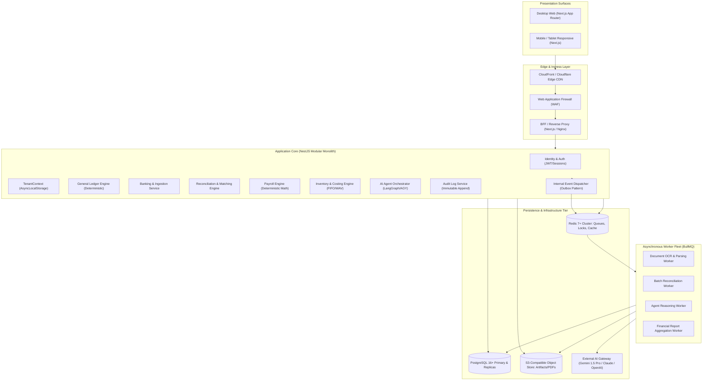
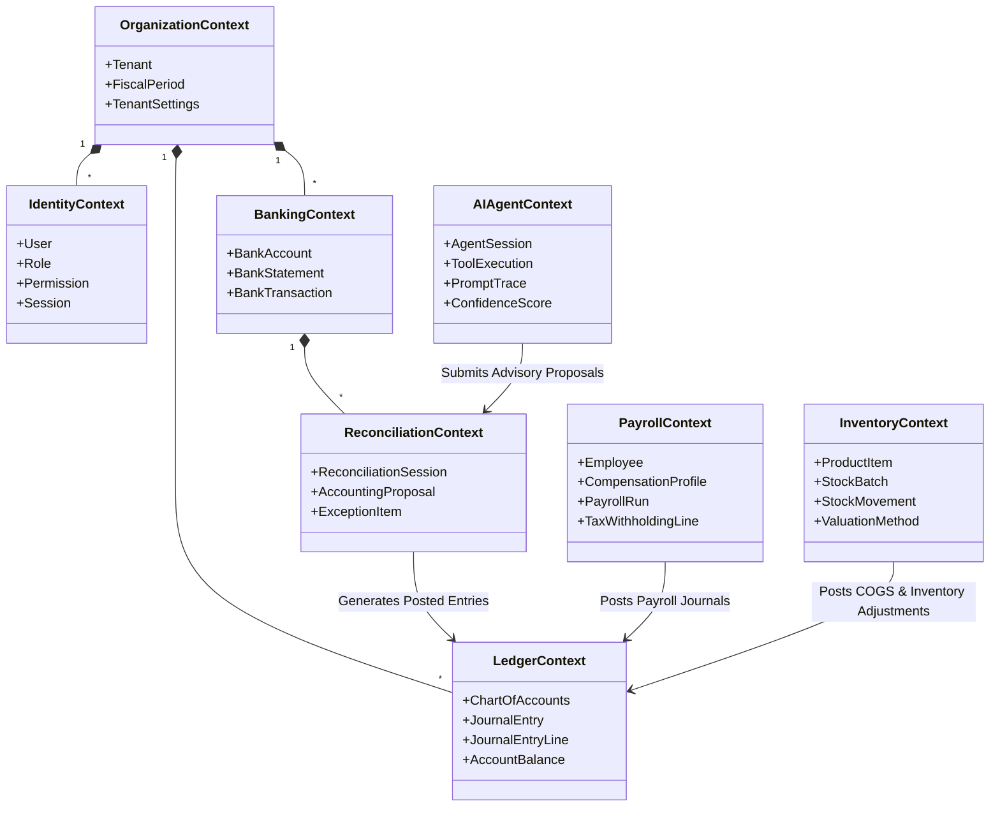
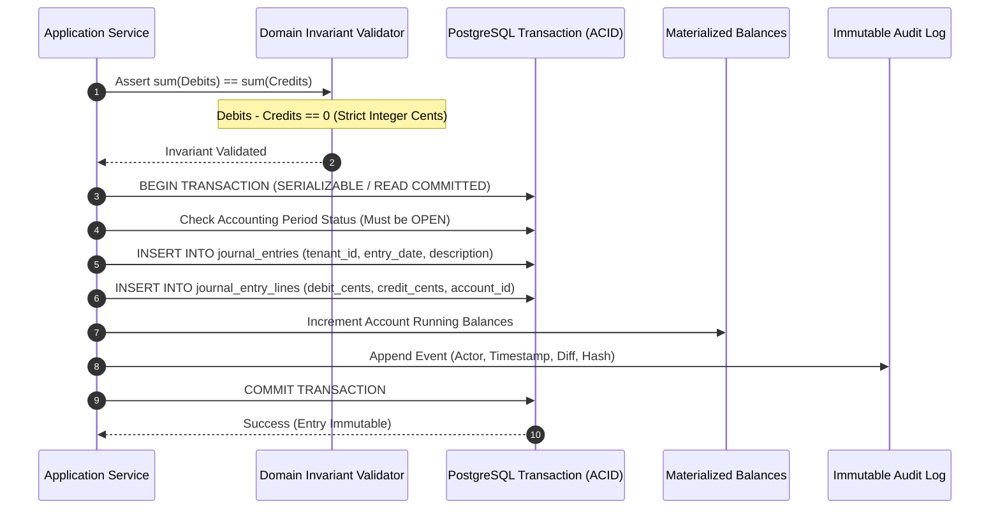
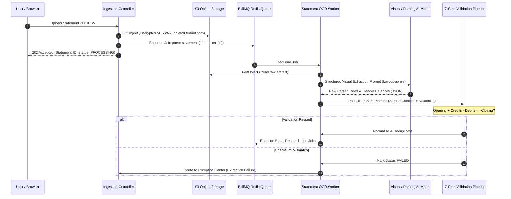
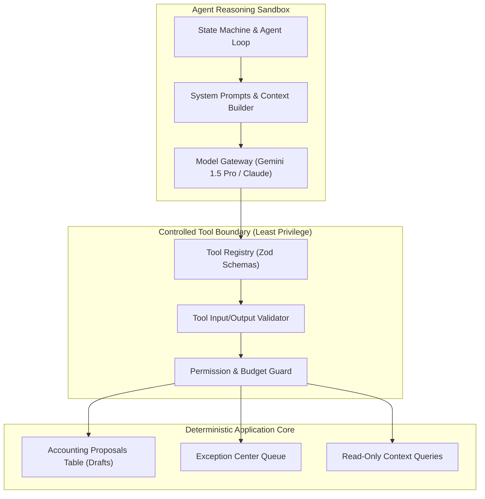
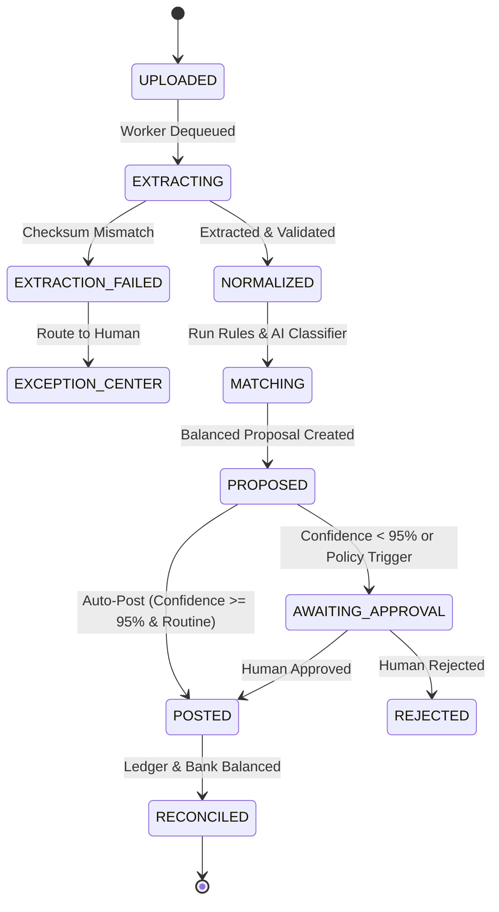
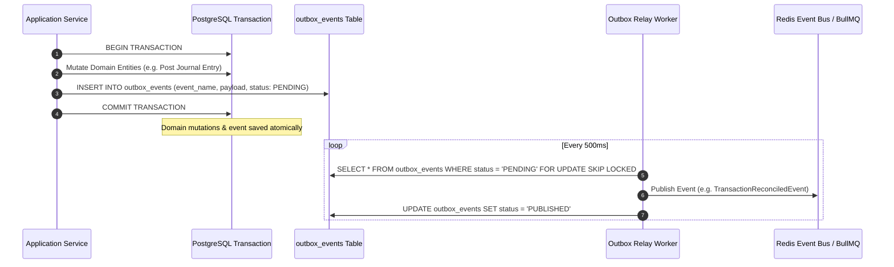

# Master System Architecture: Agentic Business OS

**Document Status:** Authoritative Master System Architecture  
**Version:** 1.0.0  
**Target Release Track:** Phase 1 (AI Accountant & Core Ledger) &rarr; Phase 2 (Payroll & Inventory Foundations) &rarr; Phase 3+ (Enterprise Multi-Agent OS)  
**Authority:** Governs all system, domain, agentic, data, security, and deployment architectures

---

> [!TIP]
>
> ### System Architecture in 60 Seconds: "The Restaurant Kitchen" Analogy
>
> Understanding this architecture is simple when you compare it to a high-end restaurant:
>
> 1. **The Waiter (Frontend - Next.js):** Takes orders from the user, shows menus, and displays prepared meals cleanly on desktop, tablet, and mobile.
> 2. **The Floor Manager (NestJS Controllers & API):** Verifies the guest's identity (multi-tenant authentication), stamps the ticket, and routes the request to the right station.
> 3. **The Strict Recipe Book (Deterministic Core Engine):** The unbreakable accounting laws. It enforces that Total Debits must equal Total Credits, calculates exact payroll taxes, and ensures money never appears or disappears without a record.
> 4. **The Sous-Chef (AI Assistant):** Reads messy delivery slips (bank statements & receipts), cleans up vendor names, and prepares proposals for the Head Chef. The AI **never** serves a dish directly to a guest without verification.
> 5. **The Safe & Pantry (PostgreSQL & Object Storage):** Stores the permanent, tamper-evident accounting records and statement files.
>
> **Why Modular Monolith?** Everything runs inside one unified, well-organized codebase. There are no messy microservice network timeouts, yet each department (Banking, Invoices, Ledger) has strict boundaries so code never turns into spaghetti.

---

## 1. System Architecture Overview

The **Agentic Business OS** is built as an event-driven **Modular Monolith** with an asynchronous worker fleet and an isolated AI agent execution layer.

Instead of splitting the system into dozens of separate microservices prematurely (which causes network lag and partial failure headaches), a modular monolith organizes the code into distinct, self-contained business modules (Identity, Banking, Ledger, Invoices) that run together with blazing speed, instant database transactions, and compile-time type safety.

### 1.1 High-Level Component Diagram



---

## 2. Domain Architecture & Bounded Contexts

The platform is partitioned into autonomous Bounded Contexts based on Domain-Driven Design (DDD).



### 2.1 Domain Boundaries Matrix

| Domain Module                   | Primary Responsibilities                                                   | Invariants Enforced                                                        | Downstream Consumers                  |
| :------------------------------ | :------------------------------------------------------------------------- | :------------------------------------------------------------------------- | :------------------------------------ |
| **Organization & Identity**     | Multi-tenancy, RBAC, session tokens, tenant configuration.                 | Every user action must map to an active tenant membership.                 | All modules.                          |
| **General Ledger Core**         | Chart of Accounts, Journal Entries, period locking, double-entry equality. | $\sum \text{Debits} == \sum \text{Credits}$; closed periods are immutable. | Banking, Payroll, Inventory, Reports. |
| **Banking & Statements**        | Bank connection registry, PDF/CSV statement ingestion, deduplication.      | Statement balance matches sum of transactions; duplicate hash check.       | Reconciliation, Audit.                |
| **Reconciliation & Exceptions** | Invoice matching, AI accounting proposals, Exception Center triage.        | Proposals cannot touch ledger directly without validation or approval.     | Ledger, Invoices, Audit.              |
| **Invoices & AR/AP**            | Customer invoices, vendor bills, payment terms, expense tracking.          | Open invoice balance cannot be negative; payments decrement balance.       | Ledger, Banking, Reconciliation.      |
| **Payroll (Phase 2)**           | Employee master, compensation schedules, gross-to-net calculations.        | Tax withholding formulas are deterministic; zero floating point math.      | Ledger, Banking.                      |
| **Inventory (Phase 2)**         | Product SKUs, warehouse stock batches, FIFO/WAV unit valuation.            | Stock quantity $\ge 0$; movements balance ledger asset accounts.           | Invoices, Ledger.                     |
| **AI Agent Sandbox**            | Layout OCR, semantic classification, counterparty resolution, reasoning.   | AI output is strictly untrusted; passes 6-stage validation gate.           | Reconciliation, Exception Center.     |

---

## 3. Frontend Architecture

- **Framework:** Next.js (App Router) with React Server Components (RSC) as the default paradigm.
- **Component Model:**
  - **Server Components (Default):** Static shells, direct data fetchers, initial layouts, metadata headers.
  - **Client Components (`'use client'`):** Interactive transaction tables, keyboard-driven triage drawers, form controls, comboboxes, theme toggles.
- **State Management:**
  - **Server State:** TanStack Query v5 with query keys partitioned by tenant and entity.
  - **URL State:** `nuqs` (type-safe search params) for table sorting, pagination, and filter chips.
  - **Local State:** React Hook Form + Zod for inputs; Radix UI primitives for dialogs and popovers.
- **Design System & Theme Engine:**
  - Semantic tokens mapped via CSS variables (`--bg-surface`, `--text-primary`, `--status-warning-base`).
  - Dark and Light theme classes (`.dark`) toggled via zero-runtime SSR-safe script preventing flash of unstyled content (FOUC).
- **Responsive Layout Strategy:**
  - Desktop ($> 1024px$): High-density tables, keyboard shortcuts (`A`, `M`, `X`, `J`/`K`), split-screen PDF preview.
  - Tablet ($768px - 1024px$): Collapsible side nav, slide-over inspection sheets.
  - Mobile ($< 768px$): Priority Triage Deck (card-based exception queue), bottom navigation bar, touch targets $\ge 44\text{px}$.

---

## 4. Backend Architecture

- **Framework:** NestJS structured around Clean Architecture / Hexagonal Ports & Adapters.
- **Dependency Injection (DI):** Services depend upon repository interfaces (`IJournalEntryRepository`), decoupling business logic from Prisma/Kysely database drivers.
- **Layer Partitioning:**
  1. **Presentation (Controllers):** Thin HTTP/REST endpoints. Extract validated DTOs, authenticate sessions, return standardized response envelopes.
  2. **Application (Services & Handlers):** Command/Query Handlers, transactional unit-of-work coordination, event emission.
  3. **Domain (Entities & Pure Math):** Double-entry balance validators, FIFO cost calculators, gross-to-net formulas.
  4. **Infrastructure (Adapters):** PostgreSQL database queries, BullMQ job dispatchers, Redis cache adapters, S3 storage clients.
- **Cross-Cutting Pipeline:**
  - Global `TenantGuard` enforcing server-side `AsyncLocalStorage` context.
  - Global `ZodValidationPipe` stripping and sanitizing untrusted inputs.
  - Global `HttpExceptionFilter` mapping domain exceptions to RFC 7807 problem envelopes with correlation IDs.

---

## 5. Database Architecture

- **Database Engine:** PostgreSQL 16+ running with UTC timezone.
- **Schema Design:**
  - **Normalized 3NF:** For the operational general ledger, banking, invoice, and payroll tables.
  - **Materialized Balances:** Read-optimized summary tables (`account_monthly_balances`) incrementally maintained on journal posting for sub-millisecond P&L and Balance Sheet reports.
- **Key Strategy:** UUID v7 for time-ordered primary keys, preventing B-tree index fragmentation under heavy insert loads.
- **Integrity & Constraints:**
  - Strict Foreign Keys with `ON DELETE RESTRICT` on all financial master and transactional records.
  - Database-level `CHECK (debit_cents >= 0 AND credit_cents >= 0)` and `CHECK (amount_cents > 0)`.
  - Unique constraint on transaction idempotency hashes: `UNIQUE(tenant_id, account_id, idempotency_hash)`.
- **Zero-Downtime Migration Discipline:** Forward-compatible expand-and-contract migrations executed via CI pipeline prior to application container rollout.

---

## 6. Multi-Tenancy Model

- **Architecture:** **Logical Shared Database, Row-Level Partitioned Multi-Tenancy**.
- **Tenant Isolation Guarantee:**
  1. Every tenant-owned table carries `tenant_id UUID NOT NULL REFERENCES tenants(id)`.
  2. Every index on a tenant-owned table leads with `tenant_id` as the primary key column (e.g., `(tenant_id, created_at)`).
  3. **Application Layer:** `TenantContext` injected via `AsyncLocalStorage` derived strictly from verified JWT claims. Never accepted from client request bodies.
  4. **Database Layer (Defense in Depth):** PostgreSQL Row-Level Security (RLS) policies enforcing `tenant_id = current_setting('app.current_tenant_id')::UUID` across all tables.
  5. Cross-tenant queries return `404 Not Found` (never `403 Forbidden`) to prevent enumeration attacks.

---

## 7. Authentication Architecture

- **Token Strategy:** Short-lived JWT Access Tokens (15-minute expiration) paired with HttpOnly, Secure, SameSite=Strict Refresh Tokens stored in Redis with cryptographic rotation.
- **Identity Management:**
  - Email + Password with Argon2id hashing.
  - Multi-Factor Authentication (MFA) via TOTP (mandatory for Controller and Admin roles).
  - SSO / SAML / OIDC integration support for enterprise tenants.
- **Session Lifecycle:** User sessions can be revoked globally or per-device instantly by deleting the refresh token session key in Redis.

---

## 8. Authorization & Role-Based Access Control (RBAC)

- **Permission Model:** Granular permissions (`journal:create`, `journal:post`, `statement:upload`, `payroll:approve`, `settings:manage`) mapped into standardized tenant roles:
  - **`TENANT_ADMIN` / `OWNER`:** Full operational and administrative access.
  - **`CONTROLLER`:** Can approve exceptions, post journal entries, lock periods, and sign payroll.
  - **`BOOKKEEPER` / `OPERATOR`:** Can upload statements, create draft invoices/bills, and resolve basic exceptions.
  - **`AUDITOR` (Read-Only):** Can view reports, general ledger, and immutable audit logs.
  - **`AI_AGENT_PRINCIPAL`:** Dedicated non-human service principal identity. Restricted to writing to staging proposal tables; zero direct ledger write permissions.
- **Enforcement:** Enforced at the controller boundary via `@Roles()` and `@RequirePermissions()` decorators backed by `RolesGuard`.

---

## 9. Deterministic Accounting Engine

The General Ledger is the authoritative financial heart of the platform.



### 9.1 Accounting Invariants

1. **Integer Minor Units:** All monetary values stored as `BIGINT` minor currency units (cents). Floating-point arithmetic is strictly banned.
2. **Double-Entry Balance:** Every journal entry must satisfy $\sum \text{Debits} - \sum \text{Credits} = 0$.
3. **Period Locking:** Entries cannot be created, edited, or backdated into a closed fiscal period.
4. **Immutability & Reversals:** Posted entries are never updated or deleted. Corrections are executed strictly via signed offsetting Reversing Journal Entries.

---

## 10. Deterministic Payroll Engine (Phase 2)

- **Calculation Engine:** Pure TypeScript deterministic mathematical functions operating on minor units.
- **Workflow:**
  1. Ingest employee compensation profile (Salary or Hours $\times$ Rate).
  2. Compute Gross Pay.
  3. Apply tenant-configured pre-tax benefit deductions.
  4. Compute statutory withholdings (Income Tax, FICA/Social Security, Medicare) using deterministic tiered rate tables.
  5. Compute Net Disbursed Pay.
  6. Generate balanced payroll draft journal entry:
     - $Dr$: Wages Expense (Gross Pay)
     - $Cr$: Payroll Taxes Payable (Withholdings)
     - $Cr$: Benefits Payable (Deductions)
     - $Cr$: Payroll Clearing / Cash Disbursed (Net Pay)
- **Authoritative Partition:** AI agents may assist in anomaly detection (e.g., flagging unusual overtime spikes), but the calculation and bank file generation are 100% deterministic.

---

## 11. Deterministic Inventory Engine (Phase 2)

- **Costing Methodologies:** Supports **FIFO (First-In, First-Out)** and **Weighted Average Cost (WAV)**.
- **Stock Batch Tracking:** Every stock inflow creates an immutable `stock_batches` record containing quantity received, unit cost in `NUMERIC(18, 4)`, and date.
- **Fulfillment & Depletion:**
  - When goods are fulfilled, the inventory engine depletes stock batches in FIFO order.
  - Computes the exact Cost of Goods Sold (COGS).
  - Generates an automatic balanced journal entry:
    - $Dr$: Cost of Goods Sold (COGS Expense)
    - $Cr$: Inventory Asset Account
- **Non-Negative Inventory Invariant:** A stock depletion cannot reduce batch quantities below zero. If physical inventory is missing, a formal `Inventory Discrepancy Adjustment` must be approved.

---

## 12. Document Processing Pipeline

The ingestion pipeline handles messy bank statements (PDF, CSV, OFX, QBO) asynchronously.



### 12.1 Multi-Bank Document Inspection & Layout Isolation Pipeline

To ingest bank statements across diverse Malaysian and global financial institutions (e.g. Maybank, Maybank Islamic, CIMB, Public Bank, RHB, Hong Leong), the system processes incoming PDFs through a modular layout-aware architecture:

```
┌─────────────────────────────────────────────────────────────────────────────┐
│                       PDF DOCUMENT INGESTION WORKFLOW                       │
│                                                                             │
│  1. DocumentInspectorService:                                               │
│     • Header signature & EOF verification (%PDF-, %%EOF)                   │
│     • Encryption & security checks (/Encrypt detection)                     │
│     • Text extractability & density metrics (chars / page)                  │
│     • Institution identification (Maybank, CIMB, Public Bank, RHB, etc.)   │
│     • Account number & statement date detection                             │
│     • Extraction mode recommendation (NATIVE_TEXT vs OCR_ASSISTED)          │
│                                                                             │
│  2. LayoutExtractorService:                                                 │
│     • Page-by-page token and line preservation                              │
│     • Recurring boilerplate isolation (PIDM, disclaimer, bank address)      │
│     • Table transaction zone extraction without cross-page pollution        │
│                                                                             │
│  3. BankAdapterRegistry & Candidate Architecture:                           │
│     • Dynamically resolves specialized adapters (Maybank, CIMB, RHB, etc.)  │
│     • Maps layouts to canonical BankTransactionCandidate instances           │
│     • Preserves signed amounts, sourceSequences, and raw primary narratives │
│     • Fallback to GenericBankAdapter & AI Vision when needed                │
└─────────────────────────────────────────────────────────────────────────────┘
```

#### Canonical Transaction Candidate Architecture

To ensure strict decoupling between diverse document layouts and the General Ledger / database entities, all bank-specific adapters emit normalized [`BankTransactionCandidate`](file:///Users/mac/Desktop/projects/agentic_crm/src/modules/banking/domain/bank-transaction-candidate.ts) records:

```ts
export interface BankTransactionCandidate {
  sourceSequence: number;
  pageNumber: number;
  sourceRowIndex?: number;
  transactionDate: string; // YYYY-MM-DD
  valueDate?: string; // YYYY-MM-DD
  direction: 'DEBIT' | 'CREDIT';
  amountCents: bigint; // Signed: negative for debit/outflow, positive for credit/inflow
  signedAmountCents: bigint;
  runningBalanceCents?: bigint;
  rawPrimaryText: string;
  rawContinuationText?: string;
  rawReferenceText?: string;
  bankReference?: string;
  counterpartyAccount?: string;
  description: string;
  normalizedPayee?: string;
  referenceNumber?: string;
  categorySuggestion?: string;
  extractionMethod: 'DETERMINISTIC_LAYOUT' | 'BANK_ADAPTER' | 'AI_VISION';
  extractionConfidence: number;
  riskLevel: 'LOW' | 'MEDIUM' | 'HIGH';
  sourceEvidence?: Record<string, unknown>;
}
```

### 12.2 Maybank & Maybank Islamic Multi-Line FSM Adapter

Malaysian bank statements—most notably Malayan Banking Berhad (Maybank) and Maybank Islamic Berhad—present distinct formatting characteristics:

1. **Trilingual Column Headers:** Malay, Chinese, and English headers (`URUSNIAGA AKAUN / 戶口進支項 / ACCOUNT TRANSACTIONS`, `TARIKH MASUK / ENTRY DATE`, `NILAI TARIKH / VALUE DATE`).
2. **Partial Dates & Year Resolution:** Transaction rows only print partial dates (`DD/MM`). The statement year must be resolved deterministically from the statement metadata block (`STATEMENT DATE : DD/MM/YY`).
3. **Trailing Sign Notation:** Debits and withdrawals append trailing minus signs (`1,500.00-`), while credits append trailing plus signs or omit signs (`1,500.00+`, `.70+`).
4. **Multi-line Continuations:** A single financial transaction spans 2 to 4 physical rows in the statement table:
   - Row 1 (Primary): `01/06 TRANSFER FR A/C 1,500.00- 12,363.00`
   - Row 2 (Payee): `KATERING SELERA RAK*` (ending in asterisk)
   - Row 3 (Narration): `Selera katerin`
   - Row 4 (Reference): `11113408564547` (14-digit DuitNow transaction reference)

To parse this structure with 100% mathematical integrity and zero hallucination, [`MaybankAdapter`](file:///Users/mac/Desktop/projects/agentic_crm/src/modules/banking/parsers/adapters/maybank.adapter.ts) executes a deterministic Finite State Machine (FSM):

```
┌─────────────────────────────────────────────────────────────────────────────┐
│                   MAYBANK MULTI-LINE FINITE STATE MACHINE                   │
│                                                                             │
│   [ Table Line Ingestion ]                                                  │
│              │                                                              │
│              ▼                                                              │
│      Is Header / Disclaimer? ──── YES ───► [ Discard / Skip ]               │
│              │ NO                                                           │
│              ▼                                                              │
│      Matches Primary Line? ────── YES ───► 1. Flush & Finalize Prior Tx     │
│   (DD/MM [DD/MM] Desc Amt Bal)             2. Start New Active Tx Candidate │
│              │ NO                          3. Parse Trailing Sign Amount    │
│              ▼                                                              │
│      Active Tx In Progress? ───── YES ───► 1. Append Continuation Line      │
│              │                             2. Extract Payee if ends in '*'  │
│              │                             3. Extract 14-16 Digit DuitNow ID│
│              ▼ NO                                                           │
│      [ Skip Out-of-Band Noise ]                                             │
└─────────────────────────────────────────────────────────────────────────────┘
```

### 12.3 Additional Malaysian Bank Adapters (Dual-Amount & Columnar Layouts)

Beyond Maybank's trilingual single-amount layout with trailing signs, major Malaysian banks utilize dual-column and multi-column formats where Debits and Credits occupy distinct columns. To parse these deterministically without AI hallucination, specialized adapters implement running balance delta verification:

$$\Delta = \text{Balance}_{\text{current}} - \text{Balance}_{\text{previous}}$$

- If $\Delta < 0$, the row is strictly a **DEBIT** of $|\Delta|$.
- If $\Delta > 0$, the row is strictly a **CREDIT** of $|\Delta|$.

| Bank Adapter                                                                                                                        | Primary Features                                           | Header Signals & Balances                                                                        | Reference Extraction                                             |
| :---------------------------------------------------------------------------------------------------------------------------------- | :--------------------------------------------------------- | :----------------------------------------------------------------------------------------------- | :--------------------------------------------------------------- |
| [`CimbAdapter`](file:///Users/mac/Desktop/projects/agentic_crm/src/modules/banking/parsers/adapters/cimb.adapter.ts)                | Dual-column (Money Out / Money In), multi-line payee       | `WANG KELUAR (DR)`, `WANG MASUK (CR)`, `BAKI / BALANCE`, `OPENING BALANCE`, `CLOSING BALANCE`    | DuitNow / Instant Transfer references (`REF: ...`, 14–18 digits) |
| [`PublicBankAdapter`](file:///Users/mac/Desktop/projects/agentic_crm/src/modules/banking/parsers/adapters/public-bank.adapter.ts)   | 6-column table with dedicated cheque number column         | `PARTICULARS`, `CHQ NO`, `DEBIT`, `CREDIT`, `BALANCE`, `BALANCE B/F`, `BALANCE C/F`              | 6-digit cheque numbers (`CHQ NO`), PB transaction IDs            |
| [`RhbAdapter`](file:///Users/mac/Desktop/projects/agentic_crm/src/modules/banking/parsers/adapters/rhb.adapter.ts)                  | Dual-column debit/credit, multi-line narrative attachments | `DESCRIPTION / BUTIRAN`, `DEBIT (RM)`, `CREDIT (RM)`, `BALANCE (RM)`, `OPENING BALANCE`          | Inward remittance & DuitNow references (`REF: ...`, `TRN: ...`)  |
| [`HongLeongAdapter`](file:///Users/mac/Desktop/projects/agentic_crm/src/modules/banking/parsers/adapters/hong-leong.adapter.ts)     | Dual-column withdrawals and deposits                       | `WITHDRAWALS (DR)`, `DEPOSITS (CR)`, `BALANCE`, `BALANCE B/F`, `BALANCE C/F`                     | Hong Leong reference codes (`HLB...`, 12–18 digits)              |
| [`AmBankAdapter`](file:///Users/mac/Desktop/projects/agentic_crm/src/modules/banking/parsers/adapters/ambank.adapter.ts)            | Dual-column debit/credit, continuous running balances      | `AMBANK (M) BERHAD`, `DEBIT`, `CREDIT`, `BALANCE`, `OPENING BALANCE`, `CLOSING BALANCE`          | `REF: ...`, `CHQ: ...`, 14–18 digit DuitNow identifiers          |
| [`BankIslamAdapter`](file:///Users/mac/Desktop/projects/agentic_crm/src/modules/banking/parsers/adapters/bank-islam.adapter.ts)     | Islamic banking terminology, dual-column Malay tables      | `BANK ISLAM MALAYSIA`, `TARIKH`, `BUTIRAN`, `DEBIT`, `KREDIT`, `BAKI`, `BAKI AWAL`, `BAKI AKHIR` | `NO. RUJUKAN: ...`, `REF: ...`, DuitNow IDs                      |
| [`GenericBankAdapter`](file:///Users/mac/Desktop/projects/agentic_crm/src/modules/banking/parsers/adapters/generic-bank.adapter.ts) | Universal fallback (Alliance, Affin, UOB, OCBC, Future)    | Adaptive pipe and whitespace parsing, dual & single-column amounts, balance reconciliation       | Flexible regex extraction (`REF`, `CHQ`, invoice numbers)        |

### 12.4 Deterministic Financial Validation Engine & Zero-Tolerance Gates (Phase 6)

Financial statements ingested by the platform pass through a zero-tolerance deterministic mathematical gate in [`StatementValidationService`](file:///Users/mac/Desktop/projects/agentic_crm/src/modules/banking/services/statement-validation.service.ts) before any transaction lines or accounting proposals can be committed to the database.

```
┌─────────────────────────────────────────────────────────────────────────────┐
│                 DETERMINISTIC FINANCIAL VALIDATION ENGINE                   │
│                                                                             │
│   Parsed Statement (Opening, Closing, Stated Totals, Candidate Rows)        │
│                                     │                                       │
│                                     ▼                                       │
│      [ Gate 1: Checksum Equation ]                                          │
│      Opening + Σ(Credits) - Σ(Debits) == Closing ?                          │
│         ├─ NO ──► Reject (CHECKSUM_MISMATCH, CRITICAL)                      │
│         └─ YES                                                              │
│                                     │                                       │
│                                     ▼                                       │
│      [ Gate 2: Continuous Step-by-Step Running Balance ]                     │
│      For each row i: Balance[i] == Balance[i-1] + Amount[i] ?                │
│         ├─ NO ──► Reject (RUNNING_BALANCE_BREAK, CRITICAL)                  │
│         └─ YES                                                              │
│                                     │                                       │
│                                     ▼                                       │
│      [ Gate 3: Header Summation & Boundary Integrity ]                      │
│      Σ(Debits) == HeaderTotalDebits && Σ(Credits) == HeaderTotalCredits ?    │
│      Dates in statement period bounds ?                                     │
│         ├─ NO ──► Reject / Flag (SUMMATION_MISMATCH / DATE_OUT_OF_BOUNDS)   │
│         └─ YES                                                              │
│                                     │                                       │
│                                     ▼                                       │
│      [ Ingestion Approved: Commit Statement & Persist Transactions ]        │
└─────────────────────────────────────────────────────────────────────────────┘
```

#### Zero-Tolerance Rules & Exception Routing

1. **Master Mathematical Checksum:**
   $$\text{OpeningBalanceCents} + \sum \text{CreditsCents} - \sum \text{DebitsCents} \equiv \text{ClosingBalanceCents}$$
   - Any difference ($\ne 0\text{ cents}$) halts processing immediately with a `CRITICAL` severity violation.
2. **Step Progression Continuity:**
   $$\text{Balance}_i \equiv \text{Balance}_{i-1} + \text{Amount}_i \quad \forall i \in [1, N]$$
   - Detects torn rows, skipped pages, OCR truncation, or missing intermediate transactions. The exact step number, page number, and delta are isolated.
3. **Automated Exception Center Isolation:**
   - If any `CRITICAL` or `HIGH` validation error occurs, the statement is saved with status `FAILED`.
   - A `RECONCILIATION_EXCEPTION` item is created in the Exception Center with complete structured audit evidence (line evidence, delta in cents, page location).
   - **Zero Transactions Persisted:** Not a single unverified transaction is written to `bank_transactions`, preserving downstream GL posting and double-entry invariants without requiring rollbacks.

---

## 13. AI Agent Architecture

AI agents operate as bounded reasoning engines built upon state machines (LangGraph or Google Antigravity SDK).



### 13.1 Agent Principles

1. **Advisory Role Only:** Agents submit proposals to staging tables (`proposals`). They possess zero write access to posted ledgers or bank disbursement APIs.
2. **Stateless Execution with Ephemeral Context:** Agents do not hold uncommitted memory across executions. State is passed in via explicit context windows compiled from active tenant records.
3. **Execution Limits:** Hard cap on agent execution budgets (max 5 tool calls per task, max 30s timeout) to prevent infinite reasoning loops.

---

## 14. Agent Tools Specification

All agent tools are declared with strict JSON / Zod schemas.

| Tool Name                    | Scope           | Permissions        | Parameters                                                                                 | Return Schema                                   |
| :--------------------------- | :-------------- | :----------------- | :----------------------------------------------------------------------------------------- | :---------------------------------------------- |
| `lookup_chart_of_accounts`   | Read            | `coa:read`         | `{ search?: string, type?: AccountType }`                                                  | `AccountDto[]`                                  |
| `find_vendor_by_name`        | Read            | `vendor:read`      | `{ rawName: string }`                                                                      | `{ vendorId, cleanName, confidence }`           |
| `search_open_invoices`       | Read            | `invoice:read`     | `{ vendorId?, amountCents?, toleranceCents? }`                                             | `InvoiceDto[]`                                  |
| `create_accounting_proposal` | Write (Staging) | `proposal:create`  | `{ statementLineId, debitAccountId, creditAccountId, amountCents, rationale, confidence }` | `{ proposalId, status: "PROPOSED" }`            |
| `flag_anomaly_exception`     | Write (Staging) | `exception:create` | `{ statementLineId, reason, priority, hypothesis }`                                        | `{ exceptionId, routedTo: "EXCEPTION_CENTER" }` |

---

## 15. Agent Permissions & Guardrails

- **Least-Privilege Execution Tokens:** Each agent invocation generates an ephemeral execution context with scoped permissions.
- **Banned Capabilities:**
  - Agents cannot execute raw SQL or unvetted database queries.
  - Agents cannot initiate bank transfers, sign payroll runs, or delete records.
  - Agents cannot modify access control roles or tenant configuration.

---

## 16. Agent Memory & Context Window Management

- **No Unbounded Memory Graphs:** Avoid complex, hallucination-prone long-term agent memory vector stores.
- **Deterministic Working Memory:** Working memory is composed dynamically on demand:
  1. Active tenant Chart of Accounts.
  2. Last 30 days of verified vendor-to-account classification mappings.
  3. Historical transactions matching the normalized counterparty string.
- **Token Compaction:** Historical context is trimmed and formatted as high-density tabular Markdown to minimize LLM token consumption.

---

## 17. Workflow Engine & State Machines

Complex multi-step processes (e.g., Bank Statement Ingestion, Month-End Close, Payroll Approval) are governed by deterministic Finite State Machines (FSM).



---

## 18. Background Jobs & Worker Architecture

- **Queue Engine:** **BullMQ** backed by isolated Redis 7+ cluster.
- **Reliability & Idempotency:**
  - Every job carries an explicit `jobId` derived from the entity ID (e.g., `stmt-parse-019284`).
  - If a worker crashes mid-task, BullMQ stalls the job and moves it to retry with exponential backoff.
- **Dead Letter Queue (DLQ):** Jobs failing 3 consecutive attempts are moved to the DLQ (`business-os:dlq`), generating a high-priority alert for engineering on-call.

---

## 19. Event-Driven Workflows & Transactional Outbox

To prevent dual-write inconsistencies between PostgreSQL and Redis/Message Queues, the system implements the **Transactional Outbox Pattern**.



---

## 20. Immutable Audit System

- **Append-Only Event Store:** Every financial mutation, user authentication, role alteration, and AI recommendation is recorded in `audit_events`.
- **Tamper-Evident Hashing:** Each audit row contains a cryptographic SHA-256 hash of its contents chained to the hash of the preceding record (`previous_hash`), forming a verifiable audit chain for external SOC 2 and financial auditors.
- **Zero Mutation Guarantee:** Database rules explicitly prohibit `UPDATE` or `DELETE` on `audit_events`.

---

## 21. Notification System

- **Operational Notification Tiers:**
  - **In-App Toast & Drawer:** Real-time updates via Server-Sent Events (SSE) or WebSockets (`ExceptionAssigned`, `BatchPosted`).
  - **Email Digests:** Summaries sent to controllers and founders (e.g., _"3 exceptions require your attention"_).
  - **Slack / Webhook Alerts:** Real-time webhook notifications for urgent policy violations or disbursements exceeding thresholds.
- **Notification Anti-Noise Rule:** Routine background auto-reconciliations do not send intrusive notifications; they collapse into quiet daily activity counters.

---

## 22. File Storage Architecture

- **Storage Provider:** S3-compatible Object Storage (AWS S3, Cloudflare R2, MinIO for local dev).
- **Bucket Layout:**
  ```
  s3://agentic-os-artifacts/
  └── tenants/{tenant_id}/
      ├── statements/{statement_id}/{original_filename}.pdf
      ├── receipts/{invoice_id}/{hash}.png
      └── exports/{report_id}/{timestamp}.pdf
  ```
- **Security & Access Control:**
  - Direct public bucket access is disabled (`BlockPublicAccess: true`).
  - Files are accessed exclusively via short-lived pre-signed URLs ($15\text{ minutes}$ expiration).
  - Server-Side Encryption with AES-256 (SSE-S3 / SSE-KMS).

---

## 23. API Boundaries & External Integrations

- **Ingress Boundary:** Next.js BFF and NestJS REST API with OpenAPI v3 specification.
- **External Integration Adapters:**
  - **Banking Gateways:** Plaid / Teller / Yodlee for automated account feeds; manual PDF/CSV ingestion as the core fallback.
  - **Payment Processors:** Stripe / Modern Treasury webhooks for automated settlement feeds.
  - **AI Model Providers:** Unified `AiModelGateway` abstraction layer routing between Google Gemini, Anthropic Claude, and OpenAI with automated failover and rate-limit backoff.

---

## 24. Error Handling Architecture

- **Unified Error Hierarchy:** Rooted in `AppError` categorized into Domain, Validation, Auth, Conflict, Infrastructure, External API, and AI Provider errors (fully detailed in [`/docs/ERROR_HANDLING.md`](file:///Users/mac/Desktop/projects/agentic_crm/docs/ERROR_HANDLING.md)).
- **Client Sanitization:** Production errors return RFC 7807 problem envelopes with a unique `correlationId`. Internal database schemas and stack traces are stripped.
- **AI Provider Failures:** Catch malformed outputs, run 1 structured correction retry, and gracefully fall back to human routing in the Exception Center on repeated failure.

---

## 25. Observability & Telemetry

- **Unified Tracing:** OpenTelemetry instrumentation across HTTP routes, BullMQ jobs, and AI agent spans.
- **Prometheus Metrics:** Exported on `/metrics`, tracking business invariants (`ledger_unbalanced_attempts_total` must be 0), straight-through reconciliation ratios, and queue depths.
- **Structured Logging:** Standardized JSON emitted to `stdout` with automated PII and credit/bank card redaction (detailed in [`/docs/LOGGING_STANDARDS.md`](file:///Users/mac/Desktop/projects/agentic_crm/docs/LOGGING_STANDARDS.md)).
- **Error Tracking:** Sentry integration with tenant context tagging and automated request header scrubbing.

---

## 26. Security Architecture & Threat Model

### 26.1 STRIDE Threat Modeling Analysis

| STRIDE Threat              | Potential Vulnerability                                                        | Architectural Countermeasure                                                                                                                                   |
| :------------------------- | :----------------------------------------------------------------------------- | :------------------------------------------------------------------------------------------------------------------------------------------------------------- |
| **Spoofing**               | Adversary impersonates tenant controller or admin.                             | Argon2id password hashing, mandatory MFA for controllers, short-lived JWTs, cryptographic session rotation in Redis.                                           |
| **Tampering**              | Malicious client alters `tenant_id` or modifies posted ledger lines.           | Server-derived `TenantContext` via `AsyncLocalStorage`; PostgreSQL RLS; immutable append-only ledger tables; double-entry database constraints.                |
| **Repudiation**            | User denies approving a fraudulent transaction proposal.                       | Cryptographically chained append-only `audit_events` logging user UUID, IP address, timestamp, diff, and session signature.                                    |
| **Information Disclosure** | Cross-tenant data leakage via SQL query or API response.                       | Mandatory `tenant_id` index scoping on every query; PostgreSQL RLS; 404 responses instead of 403 on missing tenant resources; automated PII log scrubbing.     |
| **Denial of Service**      | Resource exhaustion via 1,000-page bank statement upload or unbounded queries. | S3 upload file size limits ($25\text{MB}$); BullMQ worker concurrency limits; mandatory pagination (`LIMIT 100` max); API rate limiting (`@nestjs/throttler`). |
| **Elevation of Privilege** | AI Agent attempts to execute arbitrary ledger mutations.                       | Agents operate under restricted service principal identities; write permissions restricted strictly to staging proposal tables; zero direct ledger access.     |

---

## 27. Testing Strategy

- **Unit Testing (Vitest / Jest):** Pure domain logic, double-entry mathematical equality, tax formulas, Zod schemas, React hooks. Target: 100% coverage on financial formulas.
- **Integration Testing (Testcontainers):** Repositories, database transactions, multi-tenant RLS policies, and BullMQ worker pipelines executed against real ephemeral PostgreSQL and Redis Docker containers.
- **E2E & Workflow Testing (Playwright):** Full user journeys: bank statement upload &rarr; OCR parse &rarr; proposal review &rarr; ledger post &rarr; balance sheet verification.
- **Property-Based Testing (`fast-check`):** Generative validation verifying that randomized combinations of debits and credits always maintain double-entry equality ($\sum Dr - \sum Cr == 0$).

---

## 28. Deployment Architecture

- **Containerization:** Multi-stage Docker builds producing minimal, secure Alpine/Distroless images for Next.js web frontend and NestJS API/worker backend.
- **Orchestration:** Managed Kubernetes (EKS / GKE) or AWS ECS with separate scaling groups:
  - `web-service`: Next.js web application.
  - `api-service`: NestJS REST API endpoints.
  - `worker-fleet`: Background BullMQ processors for statement OCR and AI agents.
- **Database & Cache:** Managed PostgreSQL (AWS RDS / Aurora) with multi-AZ replication; Managed Redis (AWS ElastiCache / Redis Cloud).

---

## 29. Scaling Strategy

1. **Read Scaling:** Read-heavy financial reporting queries route to read-replica PostgreSQL instances using database connection pooling.
2. **Horizontal Worker Scaling:** BullMQ worker fleet auto-scales based on queue depth (`queue_jobs_waiting_count`).
3. **Database Write Partitioning (Future Roadmap):** If transaction volumes exceed single-node PostgreSQL limits in Phase 3, partition high-volume tables (`journal_entry_lines`, `bank_transactions`) by date ranges and tenant hash shards.
4. **AI Cost & Rate-Limit Optimization:** Semantic caching in Redis for identical document layouts and vendor classification strings, reducing LLM API token consumption by up to $60\%$.

---

## 30. Implementation Phases & Roadmap

```
┌─────────────────────────────────────────────────────────────────────────────┐
│                          PHASE 1: AI ACCOUNTANT MVP                         │
│  • Organization, Users & RBAC Multi-Tenancy                                 │
│  • Chart of Accounts & Deterministic General Ledger                         │
│  • Banking, PDF/CSV Statement Parser Pipeline & Reconciliation              │
│  • Exception Center & Advisory AI Accountant Agent                          │
│  • Financial Reports (P&L, Balance Sheet, Cash Flow) & Immutable Audit Log  │
└──────────────────────────────────────┬──────────────────────────────────────┘
                                       │
                                       ▼
┌─────────────────────────────────────────────────────────────────────────────┐
│                   PHASE 2: OPERATIONS & PAYROLL FOUNDATIONS                 │
│  • Deterministic Payroll Engine (Employees, Tiered Withholding, Pay Runs)   │
│  • Deterministic Inventory Engine (Products/SKUs, Stock Batches, FIFO/WAV)  │
│  • Basic Purchasing & Vendor Invoicing 3-Way Matching                       │
└──────────────────────────────────────┬──────────────────────────────────────┘
                                       │
                                       ▼
┌─────────────────────────────────────────────────────────────────────────────┐
│                   PHASE 3+: ENTERPRISE MULTI-AGENT OS                       │
│  • Cooperating Autonomous Agents: HR, CRM, Sales, Support, CEO/BI           │
│  • Cross-Agent Orchestration & Inter-Company Consolidations                 │
└─────────────────────────────────────────────────────────────────────────────┘
```

---

## 31. Open Questions & Architectural Tradeoffs

The following items are documented as architectural questions requiring validation during Phase 1 benchmarking:

1. **[Open Question - AI Model Selection] Multi-Modal OCR Performance vs. Dedicated OCR Engine:**
   - _Tradeoff:_ Using Gemini 1.5 Pro / Claude 3.5 Sonnet directly for visual statement parsing provides superior semantic table understanding out of the box, but may cost $\$0.02 - \$0.05$ per page compared to a hybrid pipeline (AWS Textract / Tesseract for layout + LLM for classification).
   - _Status:_ **Requires benchmark testing** against a dataset of 50 diverse bank statement PDFs.
2. **[Open Question - Event Bus Technology] Redis Streams vs. RabbitMQ / Kafka:**
   - _Tradeoff:_ Redis / BullMQ satisfies all Phase 1 and Phase 2 queueing, outbox, and background job requirements without adding infrastructure overhead. In Phase 3, if multi-agent event streaming exceeds $10,000\text{ events/sec}$, evaluating Kafka or AWS SQS/SNS will be necessary.
   - _Status:_ **Decision deferred to Phase 3**.
3. **[Open Question - Real-Time Transport] Server-Sent Events (SSE) vs. WebSockets for Exception Center:**
   - _Tradeoff:_ SSE is simpler, HTTP/2 multiplexed, and ideal for server-to-client notifications (e.g., job progress, new exceptions). WebSockets allow bidirectional communication but introduce stateful connection management complexity in clustered environments.
   - _Status:_ **Tentatively adopting SSE for Phase 1**; upgrading to WebSockets only if real-time collaborative multi-user editing is required.
