# Database Schema & Domain Model Specification

**Document Status:** Authoritative Database & Domain Model Specification  
**Version:** 1.0.0  
**Target Engine:** PostgreSQL 16+  
**Authority:** Governs all tables, columns, constraints, foreign keys, indexes, and domain entities

---

## 1. Architectural Invariants Across All Schemas

Every table defined in this document conforms to the following non-negotiable rules:

1. **Strict Multi-Tenant Scoping:** Every tenant-owned table contains `tenant_id UUID NOT NULL REFERENCES tenants(id) ON DELETE RESTRICT`. All indexes on tenant tables lead with `tenant_id`.
2. **Deterministic Monetary Representation:** Minor currency units stored as `BIGINT` (`amount_cents`). Fractional rates and unit costs stored as `NUMERIC(18, 4)`. Floating-point types are strictly forbidden.
3. **Concurrency Control:** All mutable operational records carry `version INT NOT NULL DEFAULT 1` for Optimistic Concurrency Control (OCC).
4. **Time & History Discipline:** Timestamps use `TIMESTAMPTZ` recorded strictly in UTC (`DEFAULT clock_timestamp()`).
5. **Immutable Financial State:** `journal_entries`, `journal_entry_lines`, and `audit_events` are append-only. Modifying or deleting posted records is blocked at the database trigger layer. Corrections require explicit Reversing Journal Entries.
6. **No Speculative Enterprise Bloat:** Tables are created strictly for Phase 1 and Phase 2 requirements, built with polymorphic extension anchors that cleanly support future domains (HR, CRM, Sales, Support, Operations) without speculative columns.

---

## 2. Domain 1: Identity & Access Management (IAM)

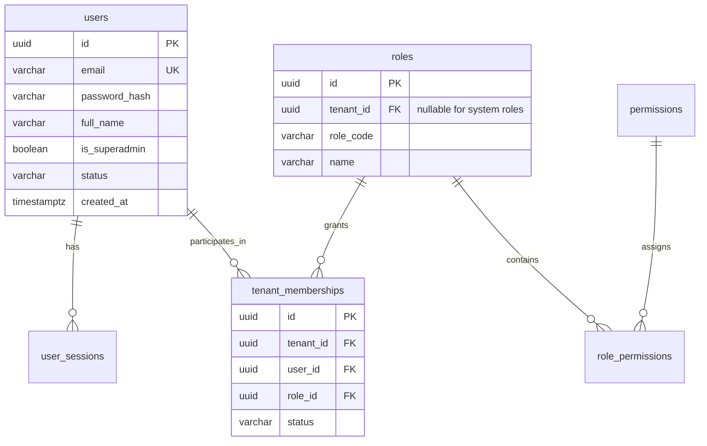

### 2.1 Table Specifications

#### `users`

- **Why it exists:** Global identity record for human operators and auditors across the platform. A user can belong to multiple tenant organizations.

```sql
CREATE TABLE users (
    id UUID PRIMARY KEY DEFAULT gen_random_uuid(),
    email VARCHAR(255) NOT NULL,
    password_hash VARCHAR(255) NOT NULL,
    full_name VARCHAR(150) NOT NULL,
    is_mfa_enabled BOOLEAN NOT NULL DEFAULT FALSE,
    mfa_secret_encrypted VARCHAR(255),
    is_superadmin BOOLEAN NOT NULL DEFAULT FALSE,
    status VARCHAR(50) NOT NULL DEFAULT 'ACTIVE', -- ACTIVE, SUSPENDED, INVITED
    created_at TIMESTAMPTZ NOT NULL DEFAULT clock_timestamp(),
    updated_at TIMESTAMPTZ NOT NULL DEFAULT clock_timestamp(),
    version INT NOT NULL DEFAULT 1,
    CONSTRAINT chk_users_status CHECK (status IN ('ACTIVE', 'SUSPENDED', 'INVITED'))
);
CREATE UNIQUE INDEX uq_users_email ON users (LOWER(email));
```

#### `user_sessions`

- **Why it exists:** Manages active device sessions and refresh token revocation in PostgreSQL (mirrored in Redis for fast caching).

```sql
CREATE TABLE user_sessions (
    id UUID PRIMARY KEY DEFAULT gen_random_uuid(),
    user_id UUID NOT NULL REFERENCES users(id) ON DELETE CASCADE,
    refresh_token_hash VARCHAR(64) NOT NULL,
    user_agent VARCHAR(500),
    ip_address INET,
    expires_at TIMESTAMPTZ NOT NULL,
    is_revoked BOOLEAN NOT NULL DEFAULT FALSE,
    created_at TIMESTAMPTZ NOT NULL DEFAULT clock_timestamp()
);
CREATE INDEX idx_user_sessions_user_active ON user_sessions (user_id) WHERE is_revoked = FALSE;
CREATE INDEX idx_user_sessions_token_hash ON user_sessions (refresh_token_hash);
```

#### `roles`

- **Why it exists:** RBAC role definitions. Can be system-level (default roles) or tenant-customized.

```sql
CREATE TABLE roles (
    id UUID PRIMARY KEY DEFAULT gen_random_uuid(),
    tenant_id UUID REFERENCES tenants(id) ON DELETE CASCADE, -- NULL indicates global system role
    role_code VARCHAR(50) NOT NULL, -- OWNER, CONTROLLER, BOOKKEEPER, AUDITOR, AI_AGENT
    name VARCHAR(100) NOT NULL,
    description VARCHAR(255),
    created_at TIMESTAMPTZ NOT NULL DEFAULT clock_timestamp(),
    CONSTRAINT uq_roles_tenant_code UNIQUE NULLS NOT DISTINCT (tenant_id, role_code)
);
```

#### `permissions`

- **Why it exists:** Fine-grained authorization capabilities assigned to roles.

```sql
CREATE TABLE permissions (
    id UUID PRIMARY KEY DEFAULT gen_random_uuid(),
    permission_code VARCHAR(100) NOT NULL UNIQUE, -- e.g., 'journal:post', 'statement:upload'
    category VARCHAR(50) NOT NULL,
    description VARCHAR(255) NOT NULL
);
```

#### `role_permissions`

- **Why it exists:** Associative mapping between roles and fine-grained permissions.

```sql
CREATE TABLE role_permissions (
    role_id UUID NOT NULL REFERENCES roles(id) ON DELETE CASCADE,
    permission_id UUID NOT NULL REFERENCES permissions(id) ON DELETE CASCADE,
    PRIMARY KEY (role_id, permission_id)
);
```

---

## 3. Domain 2: Organization & Tenant Context

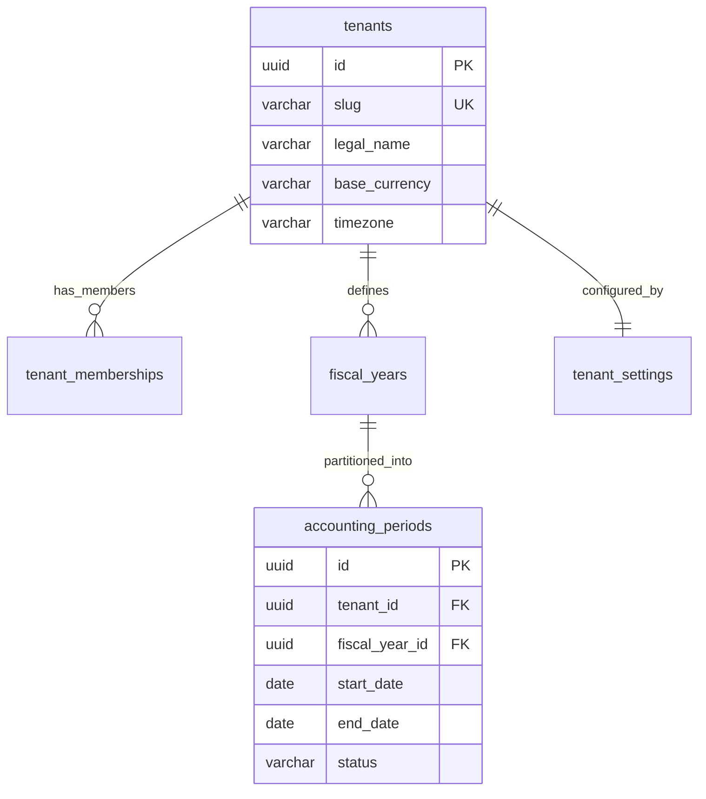

### 3.1 Table Specifications

#### `tenants`

- **Why it exists:** The root organization record representing the legally isolated SaaS subscriber.

```sql
CREATE TABLE tenants (
    id UUID PRIMARY KEY DEFAULT gen_random_uuid(),
    slug VARCHAR(63) NOT NULL UNIQUE,
    legal_name VARCHAR(255) NOT NULL,
    tax_identifier VARCHAR(100),
    base_currency CHAR(3) NOT NULL DEFAULT 'USD',
    timezone VARCHAR(50) NOT NULL DEFAULT 'UTC',
    status VARCHAR(50) NOT NULL DEFAULT 'ACTIVE', -- ACTIVE, TRIAL, DELINQUENT, SUSPENDED
    created_at TIMESTAMPTZ NOT NULL DEFAULT clock_timestamp(),
    updated_at TIMESTAMPTZ NOT NULL DEFAULT clock_timestamp(),
    version INT NOT NULL DEFAULT 1,
    CONSTRAINT chk_tenants_currency_len CHECK (LENGTH(base_currency) = 3)
);
```

#### `tenant_memberships`

- **Why it exists:** Maps users to organizations with specific RBAC roles. Guarantees that a user’s permissions are strictly scoped to the active tenant context.

```sql
CREATE TABLE tenant_memberships (
    id UUID PRIMARY KEY DEFAULT gen_random_uuid(),
    tenant_id UUID NOT NULL REFERENCES tenants(id) ON DELETE RESTRICT,
    user_id UUID NOT NULL REFERENCES users(id) ON DELETE CASCADE,
    role_id UUID NOT NULL REFERENCES roles(id) ON DELETE RESTRICT,
    status VARCHAR(50) NOT NULL DEFAULT 'ACTIVE', -- ACTIVE, INVITED, INACTIVE
    created_at TIMESTAMPTZ NOT NULL DEFAULT clock_timestamp(),
    updated_at TIMESTAMPTZ NOT NULL DEFAULT clock_timestamp(),
    CONSTRAINT uq_memberships_tenant_user UNIQUE (tenant_id, user_id)
);
CREATE INDEX idx_tenant_memberships_user ON tenant_memberships (user_id, status);
```

#### `fiscal_years`

- **Why it exists:** Governs official 12-month accounting cycles for statutory reporting.

```sql
CREATE TABLE fiscal_years (
    id UUID PRIMARY KEY DEFAULT gen_random_uuid(),
    tenant_id UUID NOT NULL REFERENCES tenants(id) ON DELETE RESTRICT,
    year_label VARCHAR(20) NOT NULL, -- e.g., 'FY2026'
    start_date DATE NOT NULL,
    end_date DATE NOT NULL,
    is_closed BOOLEAN NOT NULL DEFAULT FALSE,
    created_at TIMESTAMPTZ NOT NULL DEFAULT clock_timestamp(),
    CONSTRAINT uq_fiscal_years_tenant_label UNIQUE (tenant_id, year_label),
    CONSTRAINT chk_fiscal_years_dates CHECK (start_date < end_date)
);
CREATE INDEX idx_fiscal_years_tenant ON fiscal_years (tenant_id, start_date);
```

#### `accounting_periods`

- **Why it exists:** Enforces period locking (monthly/quarterly). The General Ledger strictly blocks posting into a period with status `LOCKED` or `CLOSED`.

```sql
CREATE TABLE accounting_periods (
    id UUID PRIMARY KEY DEFAULT gen_random_uuid(),
    tenant_id UUID NOT NULL REFERENCES tenants(id) ON DELETE RESTRICT,
    fiscal_year_id UUID NOT NULL REFERENCES fiscal_years(id) ON DELETE RESTRICT,
    period_number INT NOT NULL, -- 1 through 12
    period_name VARCHAR(50) NOT NULL, -- e.g., 'October 2026'
    start_date DATE NOT NULL,
    end_date DATE NOT NULL,
    status VARCHAR(20) NOT NULL DEFAULT 'OPEN', -- OPEN, LOCKED, CLOSED
    closed_at TIMESTAMPTZ,
    closed_by_user_id UUID REFERENCES users(id),
    created_at TIMESTAMPTZ NOT NULL DEFAULT clock_timestamp(),
    CONSTRAINT uq_periods_tenant_number UNIQUE (tenant_id, fiscal_year_id, period_number),
    CONSTRAINT chk_periods_status CHECK (status IN ('OPEN', 'LOCKED', 'CLOSED')),
    CONSTRAINT chk_periods_dates CHECK (start_date <= end_date)
);
CREATE INDEX idx_accounting_periods_lookup ON accounting_periods (tenant_id, start_date, end_date);
```

#### `tenant_settings`

- **Why it exists:** Houses tenant-specific financial policies and AI automation guardrails.

```sql
CREATE TABLE tenant_settings (
    tenant_id UUID PRIMARY KEY REFERENCES tenants(id) ON DELETE RESTRICT,
    auto_post_min_confidence NUMERIC(3, 2) NOT NULL DEFAULT 0.95,
    max_auto_post_amount_cents BIGINT NOT NULL DEFAULT 500000, -- $5,000.00
    allow_ai_auto_posting BOOLEAN NOT NULL DEFAULT TRUE,
    require_receipt_above_cents BIGINT NOT NULL DEFAULT 7500, -- $75.00 IRS compliance threshold
    default_receivable_account_id UUID, -- References chart_of_accounts
    default_payable_account_id UUID,    -- References chart_of_accounts
    updated_at TIMESTAMPTZ NOT NULL DEFAULT clock_timestamp(),
    version INT NOT NULL DEFAULT 1,
    CONSTRAINT chk_confidence_range CHECK (auto_post_min_confidence >= 0.50 AND auto_post_min_confidence <= 1.00)
);
```

---

## 4. Domain 3: General Ledger & Accounting Core

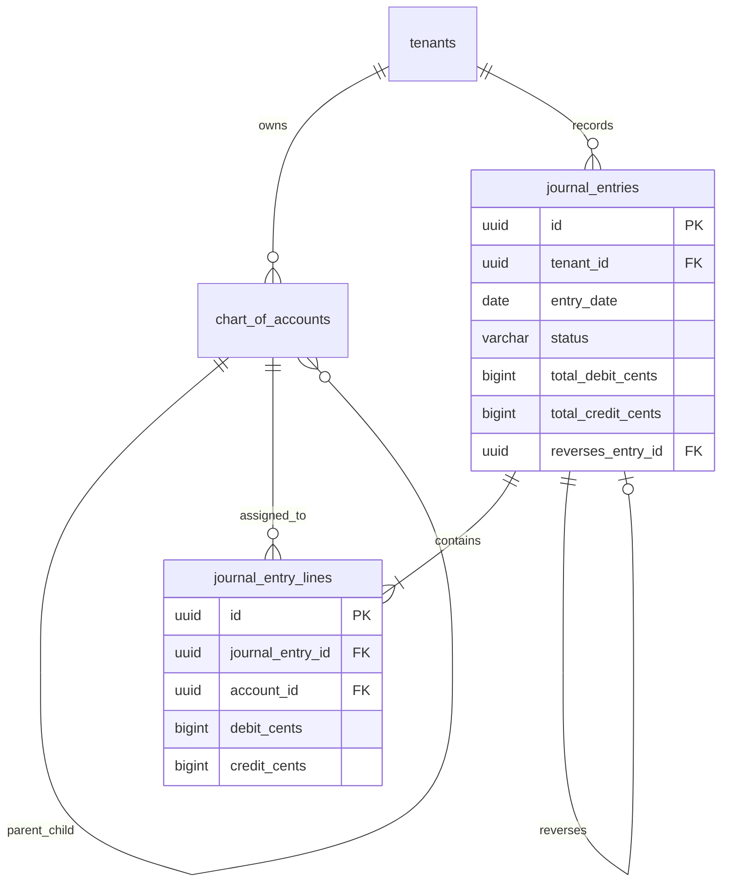

### 4.1 Table Specifications

#### `chart_of_accounts`

- **Why it exists:** The structural backbone of the accounting system. Represents standard and sub-accounts with account classifications (`ASSET`, `LIABILITY`, `EQUITY`, `REVENUE`, `EXPENSE`).

```sql
CREATE TABLE chart_of_accounts (
    id UUID PRIMARY KEY DEFAULT gen_random_uuid(),
    tenant_id UUID NOT NULL REFERENCES tenants(id) ON DELETE RESTRICT,
    account_code VARCHAR(50) NOT NULL, -- e.g., '1010', '6100'
    name VARCHAR(150) NOT NULL,
    classification VARCHAR(20) NOT NULL, -- ASSET, LIABILITY, EQUITY, REVENUE, EXPENSE
    sub_classification VARCHAR(50), -- CURRENT_ASSET, OPERATING_EXPENSE, etc.
    parent_account_id UUID REFERENCES chart_of_accounts(id) ON DELETE RESTRICT,
    is_active BOOLEAN NOT NULL DEFAULT TRUE,
    is_system_locked BOOLEAN NOT NULL DEFAULT FALSE, -- Retained Earnings & Accounts Payable cannot be deleted
    created_at TIMESTAMPTZ NOT NULL DEFAULT clock_timestamp(),
    updated_at TIMESTAMPTZ NOT NULL DEFAULT clock_timestamp(),
    version INT NOT NULL DEFAULT 1,
    CONSTRAINT uq_coa_tenant_code UNIQUE (tenant_id, account_code),
    CONSTRAINT chk_coa_classification CHECK (classification IN ('ASSET', 'LIABILITY', 'EQUITY', 'REVENUE', 'EXPENSE'))
);
CREATE INDEX idx_coa_tenant_active ON chart_of_accounts (tenant_id, is_active);
CREATE INDEX idx_coa_parent ON chart_of_accounts (parent_account_id);
```

#### `journal_entries`

- **Why it exists:** Authoritative header for posted accounting events. Strictly immutable once status is `POSTED`.

```sql
CREATE TABLE journal_entries (
    id UUID PRIMARY KEY DEFAULT gen_random_uuid(),
    tenant_id UUID NOT NULL REFERENCES tenants(id) ON DELETE RESTRICT,
    accounting_period_id UUID NOT NULL REFERENCES accounting_periods(id) ON DELETE RESTRICT,
    entry_number VARCHAR(50) NOT NULL, -- e.g., 'JE-2026-00014'
    entry_date DATE NOT NULL,
    description TEXT NOT NULL,
    status VARCHAR(20) NOT NULL DEFAULT 'DRAFT', -- DRAFT, POSTED, REVERSED
    source_type VARCHAR(50) NOT NULL, -- BANK_RECONCILIATION, MANUAL, PAYROLL, INVENTORY, INVOICE
    source_id UUID, -- Polymorphic reference to source aggregate (e.g. statement_id or payroll_run_id)
    reverses_entry_id UUID REFERENCES journal_entries(id) ON DELETE RESTRICT, -- Correction strategy
    total_debit_cents BIGINT NOT NULL DEFAULT 0,
    total_credit_cents BIGINT NOT NULL DEFAULT 0,
    created_by_user_id UUID REFERENCES users(id),
    created_by_agent_id UUID, -- Non-null if generated by an AI agent
    posted_at TIMESTAMPTZ,
    created_at TIMESTAMPTZ NOT NULL DEFAULT clock_timestamp(),
    CONSTRAINT uq_journal_entries_tenant_number UNIQUE (tenant_id, entry_number),
    CONSTRAINT chk_journal_entry_status CHECK (status IN ('DRAFT', 'POSTED', 'REVERSED')),
    CONSTRAINT chk_journal_entry_balance CHECK (total_debit_cents = total_credit_cents)
);
CREATE INDEX idx_journal_entries_tenant_date ON journal_entries (tenant_id, entry_date DESC);
CREATE INDEX idx_journal_entries_period ON journal_entries (accounting_period_id, status);
CREATE INDEX idx_journal_entries_reversal ON journal_entries (reverses_entry_id);
```

#### `journal_entry_lines`

- **Why it exists:** The discrete debit and credit components of a journal entry. Enforces strict double-entry equality ($\sum Dr - \sum Cr = 0$) and positive integer cents.

```sql
CREATE TABLE journal_entry_lines (
    id UUID PRIMARY KEY DEFAULT gen_random_uuid(),
    tenant_id UUID NOT NULL REFERENCES tenants(id) ON DELETE RESTRICT,
    journal_entry_id UUID NOT NULL REFERENCES journal_entries(id) ON DELETE CASCADE,
    account_id UUID NOT NULL REFERENCES chart_of_accounts(id) ON DELETE RESTRICT,
    line_number INT NOT NULL,
    debit_cents BIGINT NOT NULL DEFAULT 0,
    credit_cents BIGINT NOT NULL DEFAULT 0,
    memo VARCHAR(255),
    created_at TIMESTAMPTZ NOT NULL DEFAULT clock_timestamp(),
    CONSTRAINT uq_entry_line_number UNIQUE (journal_entry_id, line_number),
    CONSTRAINT chk_line_amounts_positive CHECK (debit_cents >= 0 AND credit_cents >= 0),
    CONSTRAINT chk_line_amounts_exclusive CHECK (
        (debit_cents > 0 AND credit_cents = 0) OR
        (credit_cents > 0 AND debit_cents = 0)
    )
);
CREATE INDEX idx_journal_lines_tenant_account ON journal_entry_lines (tenant_id, account_id);
CREATE INDEX idx_journal_lines_entry ON journal_entry_lines (journal_entry_id);
```

#### `account_monthly_balances`

- **Why it exists:** Materialized rollup table providing sub-millisecond retrieval of Trial Balance, Profit & Loss, and Balance Sheet reports without expensive table scans across historical lines.

```sql
CREATE TABLE account_monthly_balances (
    id UUID PRIMARY KEY DEFAULT gen_random_uuid(),
    tenant_id UUID NOT NULL REFERENCES tenants(id) ON DELETE RESTRICT,
    account_id UUID NOT NULL REFERENCES chart_of_accounts(id) ON DELETE RESTRICT,
    accounting_period_id UUID NOT NULL REFERENCES accounting_periods(id) ON DELETE RESTRICT,
    opening_balance_cents BIGINT NOT NULL DEFAULT 0,
    total_debit_cents BIGINT NOT NULL DEFAULT 0,
    total_credit_cents BIGINT NOT NULL DEFAULT 0,
    closing_balance_cents BIGINT NOT NULL DEFAULT 0,
    updated_at TIMESTAMPTZ NOT NULL DEFAULT clock_timestamp(),
    CONSTRAINT uq_account_period_balance UNIQUE (tenant_id, account_id, accounting_period_id)
);
CREATE INDEX idx_account_balances_lookup ON account_monthly_balances (tenant_id, accounting_period_id);
```

---

## 5. Domain 4: Banking & Reconciliation

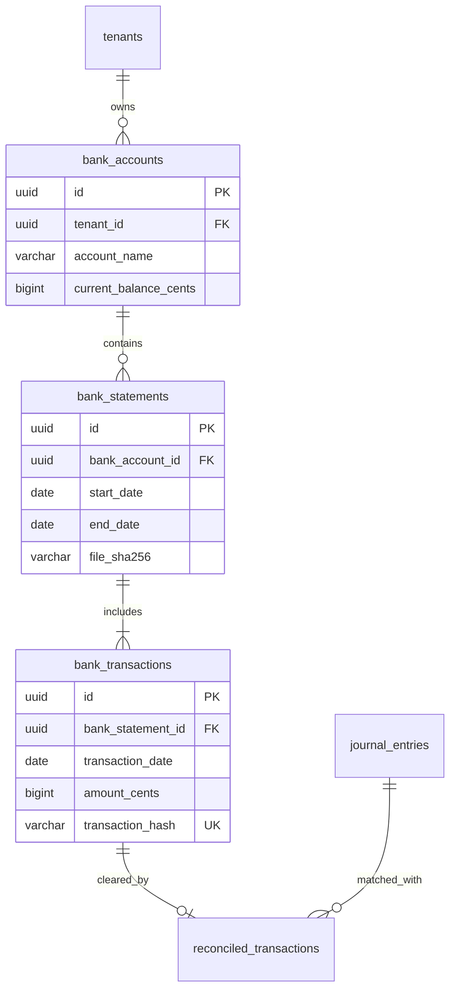

### 5.1 Table Specifications

#### `bank_accounts`

- **Why it exists:** Represents checking accounts, credit cards, or merchant balances (e.g. Silicon Valley Bank Checking, Stripe Payouts).

```sql
CREATE TABLE bank_accounts (
    id UUID PRIMARY KEY DEFAULT gen_random_uuid(),
    tenant_id UUID NOT NULL REFERENCES tenants(id) ON DELETE RESTRICT,
    ledger_account_id UUID NOT NULL REFERENCES chart_of_accounts(id) ON DELETE RESTRICT,
    account_name VARCHAR(150) NOT NULL,
    institution_name VARCHAR(150) NOT NULL,
    account_type VARCHAR(50) NOT NULL, -- CHECKING, SAVINGS, CREDIT_CARD
    currency CHAR(3) NOT NULL DEFAULT 'USD',
    account_number_last4 CHAR(4) NOT NULL,
    current_balance_cents BIGINT NOT NULL DEFAULT 0,
    reconciled_balance_cents BIGINT NOT NULL DEFAULT 0,
    is_active BOOLEAN NOT NULL DEFAULT TRUE,
    created_at TIMESTAMPTZ NOT NULL DEFAULT clock_timestamp(),
    updated_at TIMESTAMPTZ NOT NULL DEFAULT clock_timestamp(),
    version INT NOT NULL DEFAULT 1
);
CREATE INDEX idx_bank_accounts_tenant ON bank_accounts (tenant_id, is_active);
```

#### `bank_statements`

- **Why it exists:** Master record for an ingested PDF or CSV statement artifact. Enforces period deduplication, mathematical checksums, and parser lineage tracking.

```sql
CREATE TABLE bank_statements (
    id UUID PRIMARY KEY DEFAULT gen_random_uuid(),
    tenant_id UUID NOT NULL REFERENCES tenants(id) ON DELETE RESTRICT,
    bank_account_id UUID NOT NULL REFERENCES bank_accounts(id) ON DELETE RESTRICT,
    source_document_id UUID NOT NULL REFERENCES documents(id) ON DELETE RESTRICT,
    statement_start_date DATE NOT NULL,
    statement_end_date DATE NOT NULL,
    opening_balance_cents BIGINT NOT NULL,
    closing_balance_cents BIGINT NOT NULL,
    total_debits_cents BIGINT NOT NULL DEFAULT 0,
    total_credits_cents BIGINT NOT NULL DEFAULT 0,
    file_sha256 VARCHAR(64) NOT NULL,
    status VARCHAR(30) NOT NULL DEFAULT 'UPLOADED', -- UPLOADED, PARSED, RECONCILED, EXTRACTION_FAILED
    page_count INT NOT NULL DEFAULT 1,
    extraction_mode VARCHAR(30) NOT NULL DEFAULT 'NATIVE_TEXT',
    bank_detected VARCHAR(100),
    format_detected VARCHAR(100),
    parser_version VARCHAR(50),
    bank_adapter_version VARCHAR(50),
    extraction_prompt_version VARCHAR(50),
    ai_model_version VARCHAR(50),
    validation_status VARCHAR(30) NOT NULL DEFAULT 'UNVALIDATED',
    reprocessing_of_id UUID,
    metadata JSONB,
    created_at TIMESTAMPTZ NOT NULL DEFAULT clock_timestamp(),
    updated_at TIMESTAMPTZ NOT NULL DEFAULT clock_timestamp(),
    CONSTRAINT uq_statement_file_hash UNIQUE (tenant_id, file_sha256),
    CONSTRAINT uq_statement_account_period UNIQUE (tenant_id, bank_account_id, statement_start_date, statement_end_date),
    CONSTRAINT chk_statement_dates CHECK (statement_start_date <= statement_end_date)
);
CREATE INDEX idx_bank_statements_lookup ON bank_statements (tenant_id, bank_account_id, status);
```

#### `bank_transactions`

- **Why it exists:** Extracted line items from a bank statement. Preserves exact source sequence, multi-line narrative, running balances, and confidence metrics for reconciliation.

```sql
CREATE TABLE bank_transactions (
    id UUID PRIMARY KEY DEFAULT gen_random_uuid(),
    tenant_id UUID NOT NULL REFERENCES tenants(id) ON DELETE RESTRICT,
    bank_statement_id UUID NOT NULL REFERENCES bank_statements(id) ON DELETE CASCADE,
    bank_account_id UUID NOT NULL REFERENCES bank_accounts(id) ON DELETE RESTRICT,
    page_number INT NOT NULL DEFAULT 1,
    source_sequence INT NOT NULL DEFAULT 1,
    source_row_index INT,
    transaction_date DATE NOT NULL,
    value_date DATE,
    direction VARCHAR(10) NOT NULL DEFAULT 'DEBIT', -- 'DEBIT' or 'CREDIT'
    amount_cents BIGINT NOT NULL, -- Negative for debits/withdrawals, positive for credits/deposits
    signed_amount_cents BIGINT NOT NULL DEFAULT 0,
    running_balance_cents BIGINT,
    raw_description VARCHAR(1000) NOT NULL,
    raw_primary_text VARCHAR(1000),
    raw_continuation_text TEXT,
    raw_reference_text VARCHAR(500),
    bank_reference VARCHAR(150),
    counterparty_account VARCHAR(100),
    normalized_description VARCHAR(500),
    normalized_payee VARCHAR(255),
    reference_number VARCHAR(100),
    category_suggestion VARCHAR(100),
    extraction_method VARCHAR(50) NOT NULL DEFAULT 'DETERMINISTIC',
    extraction_confidence NUMERIC(3, 2) NOT NULL DEFAULT 1.0,
    entity_resolution_confidence NUMERIC(3, 2),
    accounting_confidence NUMERIC(3, 2),
    risk_level VARCHAR(20) NOT NULL DEFAULT 'LOW',
    source_evidence JSONB,
    transaction_fingerprint VARCHAR(128),
    transaction_hash VARCHAR(64) NOT NULL, -- SHA-256(tenant_id + account_id + date + amount + description [+ sequence])
    status VARCHAR(30) NOT NULL DEFAULT 'UNRECONCILED', -- UNRECONCILED, PROPOSED, MATCHED, RECONCILED, EXCLUDED
    created_at TIMESTAMPTZ NOT NULL DEFAULT clock_timestamp()
);
CREATE INDEX idx_bank_transactions_tenant_status ON bank_transactions (tenant_id, status, transaction_date DESC);
CREATE INDEX idx_bank_transactions_statement ON bank_transactions (bank_statement_id);
CREATE INDEX idx_bank_transactions_hash ON bank_transactions (tenant_id, bank_account_id, transaction_hash);
CREATE INDEX idx_bank_transactions_statement_seq ON bank_transactions (bank_statement_id, source_sequence);
CREATE INDEX idx_bank_transactions_statement_page ON bank_transactions (bank_statement_id, page_number);
```

#### `reconciled_transactions`

- **Why it exists:** Join record proving that a specific bank transaction line has been matched and reconciled to a posted General Ledger entry.

```sql
CREATE TABLE reconciled_transactions (
    id UUID PRIMARY KEY DEFAULT gen_random_uuid(),
    tenant_id UUID NOT NULL REFERENCES tenants(id) ON DELETE RESTRICT,
    bank_transaction_id UUID NOT NULL UNIQUE REFERENCES bank_transactions(id) ON DELETE RESTRICT,
    journal_entry_id UUID NOT NULL REFERENCES journal_entries(id) ON DELETE RESTRICT,
    reconciliation_method VARCHAR(30) NOT NULL, -- AUTO_HIGH_CONFIDENCE, HUMAN_APPROVED, MANUAL_MATCH
    confidence_score NUMERIC(3, 2),
    reconciled_by_user_id UUID REFERENCES users(id),
    reconciled_at TIMESTAMPTZ NOT NULL DEFAULT clock_timestamp()
);
CREATE INDEX idx_reconciled_tx_tenant ON reconciled_transactions (tenant_id, reconciled_at);
CREATE INDEX idx_reconciled_tx_journal ON reconciled_transactions (journal_entry_id);
```

---

## 6. Domain 5: Document Management & Storage

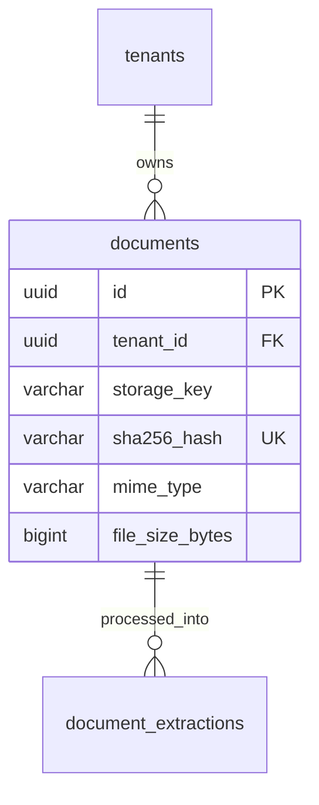

### 6.1 Table Specifications

#### `documents`

- **Why it exists:** Metadata catalog for all external files (bank statements, vendor invoices, receipt photos). Enforces `ON DELETE RESTRICT` when referenced by accounting records.

```sql
CREATE TABLE documents (
    id UUID PRIMARY KEY DEFAULT gen_random_uuid(),
    tenant_id UUID NOT NULL REFERENCES tenants(id) ON DELETE RESTRICT,
    storage_key VARCHAR(500) NOT NULL, -- S3 object key
    filename VARCHAR(255) NOT NULL,
    mime_type VARCHAR(100) NOT NULL,
    file_size_bytes BIGINT NOT NULL,
    sha256_hash VARCHAR(64) NOT NULL,
    is_archived BOOLEAN NOT NULL DEFAULT FALSE,
    uploaded_by_user_id UUID REFERENCES users(id),
    created_at TIMESTAMPTZ NOT NULL DEFAULT clock_timestamp(),
    CONSTRAINT uq_documents_tenant_sha256 UNIQUE (tenant_id, sha256_hash)
);
CREATE INDEX idx_documents_tenant_archived ON documents (tenant_id) WHERE is_archived = FALSE;
```

#### `document_extractions`

- **Why it exists:** Stores the raw structured JSON payload returned by OCR models (Gemini / Textract) for verification, auditability, and debugging.

```sql
CREATE TABLE document_extractions (
    id UUID PRIMARY KEY DEFAULT gen_random_uuid(),
    tenant_id UUID NOT NULL REFERENCES tenants(id) ON DELETE RESTRICT,
    document_id UUID NOT NULL REFERENCES documents(id) ON DELETE CASCADE,
    model_name VARCHAR(100) NOT NULL, -- e.g., 'gemini-1.5-pro-002'
    raw_payload JSONB NOT NULL,
    extracted_row_count INT NOT NULL DEFAULT 0,
    confidence_score NUMERIC(3, 2) NOT NULL,
    duration_ms INT NOT NULL,
    created_at TIMESTAMPTZ NOT NULL DEFAULT clock_timestamp()
);
CREATE INDEX idx_document_extractions_doc ON document_extractions (document_id);
```

---

## 7. Domain 6 & 7: Counterparties, Invoicing & AR/AP

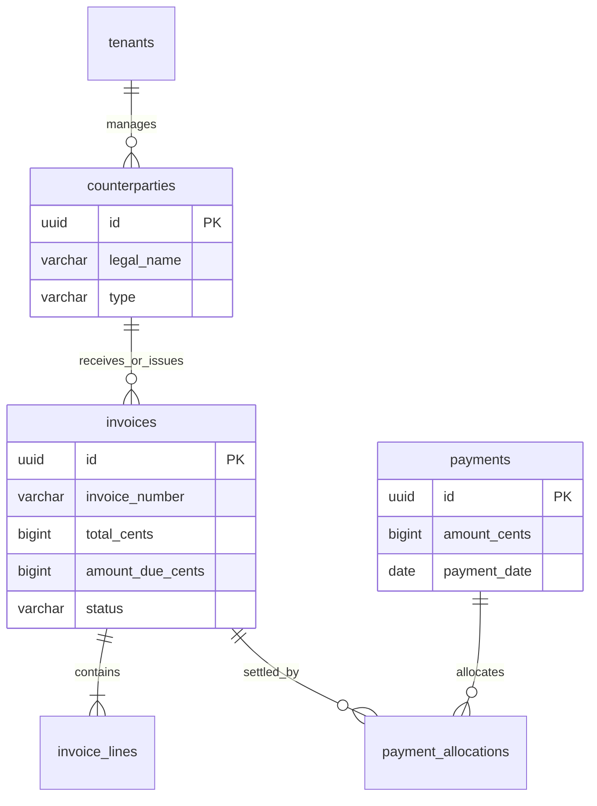

### 7.1 Table Specifications

#### `counterparties`

- **Why it exists:** Unified directory of external entities (Vendors, Suppliers, Customers). Powers AI entity resolution.

```sql
CREATE TABLE counterparties (
    id UUID PRIMARY KEY DEFAULT gen_random_uuid(),
    tenant_id UUID NOT NULL REFERENCES tenants(id) ON DELETE RESTRICT,
    type VARCHAR(20) NOT NULL, -- VENDOR, CUSTOMER, BOTH
    legal_name VARCHAR(255) NOT NULL,
    normalized_name VARCHAR(255) NOT NULL,
    tax_identifier VARCHAR(100),
    default_account_id UUID REFERENCES chart_of_accounts(id) ON DELETE RESTRICT,
    payment_terms_days INT NOT NULL DEFAULT 30,
    is_active BOOLEAN NOT NULL DEFAULT TRUE,
    created_at TIMESTAMPTZ NOT NULL DEFAULT clock_timestamp(),
    updated_at TIMESTAMPTZ NOT NULL DEFAULT clock_timestamp(),
    version INT NOT NULL DEFAULT 1,
    CONSTRAINT uq_counterparties_name UNIQUE (tenant_id, normalized_name),
    CONSTRAINT chk_counterparty_type CHECK (type IN ('VENDOR', 'CUSTOMER', 'BOTH'))
);
CREATE INDEX idx_counterparties_tenant_type ON counterparties (tenant_id, type);
```

#### `invoices`

- **Why it exists:** Handles Accounts Payable (Vendor Bills) and Accounts Receivable (Customer Invoices).

```sql
CREATE TABLE invoices (
    id UUID PRIMARY KEY DEFAULT gen_random_uuid(),
    tenant_id UUID NOT NULL REFERENCES tenants(id) ON DELETE RESTRICT,
    counterparty_id UUID NOT NULL REFERENCES counterparties(id) ON DELETE RESTRICT,
    source_document_id UUID REFERENCES documents(id) ON DELETE RESTRICT,
    journal_entry_id UUID REFERENCES journal_entries(id) ON DELETE RESTRICT, -- Set upon posting
    invoice_type VARCHAR(20) NOT NULL, -- BILL (AP), INVOICE (AR)
    invoice_number VARCHAR(100) NOT NULL,
    issue_date DATE NOT NULL,
    due_date DATE NOT NULL,
    currency CHAR(3) NOT NULL DEFAULT 'USD',
    subtotal_cents BIGINT NOT NULL,
    tax_cents BIGINT NOT NULL DEFAULT 0,
    total_cents BIGINT NOT NULL,
    amount_due_cents BIGINT NOT NULL,
    status VARCHAR(30) NOT NULL DEFAULT 'DRAFT', -- DRAFT, AWAITING_APPROVAL, APPROVED, PARTIALLY_PAID, PAID, VOID
    created_at TIMESTAMPTZ NOT NULL DEFAULT clock_timestamp(),
    updated_at TIMESTAMPTZ NOT NULL DEFAULT clock_timestamp(),
    version INT NOT NULL DEFAULT 1,
    CONSTRAINT uq_invoices_tenant_number UNIQUE (tenant_id, counterparty_id, invoice_type, invoice_number),
    CONSTRAINT chk_invoice_amounts CHECK (total_cents = subtotal_cents + tax_cents AND amount_due_cents >= 0)
);
CREATE INDEX idx_invoices_tenant_status ON invoices (tenant_id, status, due_date);
CREATE INDEX idx_invoices_counterparty ON invoices (counterparty_id);
```

#### `invoice_lines`

- **Why it exists:** Itemized lines detailing expenses or revenues with linked Chart of Accounts.

```sql
CREATE TABLE invoice_lines (
    id UUID PRIMARY KEY DEFAULT gen_random_uuid(),
    tenant_id UUID NOT NULL REFERENCES tenants(id) ON DELETE RESTRICT,
    invoice_id UUID NOT NULL REFERENCES invoices(id) ON DELETE CASCADE,
    account_id UUID NOT NULL REFERENCES chart_of_accounts(id) ON DELETE RESTRICT,
    product_id UUID, -- References products(id) for inventory items (Phase 2)
    line_number INT NOT NULL,
    description VARCHAR(255) NOT NULL,
    quantity NUMERIC(12, 4) NOT NULL DEFAULT 1.0000,
    unit_cost_cents BIGINT NOT NULL,
    total_cents BIGINT NOT NULL,
    created_at TIMESTAMPTZ NOT NULL DEFAULT clock_timestamp(),
    CONSTRAINT uq_invoice_lines_num UNIQUE (invoice_id, line_number),
    CONSTRAINT chk_line_quantity_pos CHECK (quantity > 0)
);
CREATE INDEX idx_invoice_lines_invoice ON invoice_lines (invoice_id);
```

#### `payments` & `payment_allocations`

- **Why it exists:** Records outbound checks/wires and inbound client receipts, allocating them against specific open invoices.

```sql
CREATE TABLE payments (
    id UUID PRIMARY KEY DEFAULT gen_random_uuid(),
    tenant_id UUID NOT NULL REFERENCES tenants(id) ON DELETE RESTRICT,
    counterparty_id UUID NOT NULL REFERENCES counterparties(id) ON DELETE RESTRICT,
    bank_account_id UUID NOT NULL REFERENCES bank_accounts(id) ON DELETE RESTRICT,
    journal_entry_id UUID REFERENCES journal_entries(id) ON DELETE RESTRICT,
    payment_type VARCHAR(20) NOT NULL, -- DISBURSEMENT (Outbound), RECEIPT (Inbound)
    payment_date DATE NOT NULL,
    amount_cents BIGINT NOT NULL,
    payment_method VARCHAR(50) NOT NULL, -- ACH, WIRE, CHECK, CREDIT_CARD
    reference_number VARCHAR(100),
    status VARCHAR(30) NOT NULL DEFAULT 'CLEARED',
    created_at TIMESTAMPTZ NOT NULL DEFAULT clock_timestamp(),
    CONSTRAINT chk_payment_amount CHECK (amount_cents > 0)
);

CREATE TABLE payment_allocations (
    id UUID PRIMARY KEY DEFAULT gen_random_uuid(),
    tenant_id UUID NOT NULL REFERENCES tenants(id) ON DELETE RESTRICT,
    payment_id UUID NOT NULL REFERENCES payments(id) ON DELETE RESTRICT,
    invoice_id UUID NOT NULL REFERENCES invoices(id) ON DELETE RESTRICT,
    allocated_amount_cents BIGINT NOT NULL,
    created_at TIMESTAMPTZ NOT NULL DEFAULT clock_timestamp(),
    CONSTRAINT chk_allocation_amount CHECK (allocated_amount_cents > 0)
);
CREATE INDEX idx_allocations_invoice ON payment_allocations (invoice_id);
CREATE INDEX idx_allocations_payment ON payment_allocations (payment_id);
```

---

## 8. Domain 8: Deterministic Payroll (Phase 2)

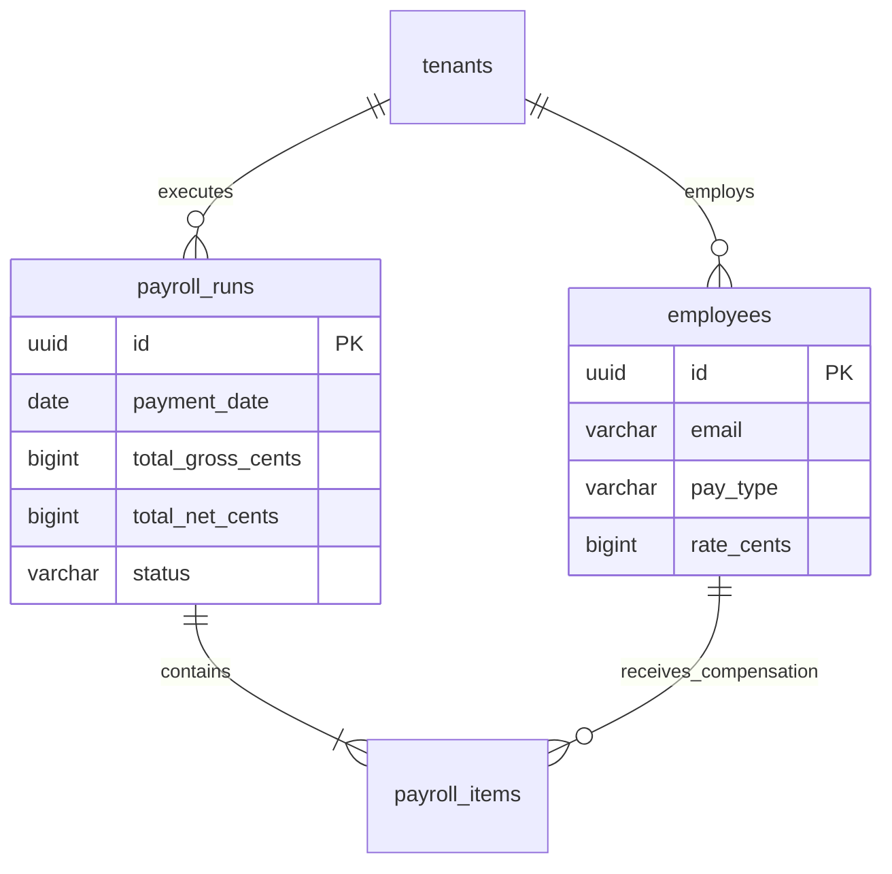

### 8.1 Table Specifications

#### `employees`

- **Why it exists:** Master compensation record for employees.

```sql
CREATE TABLE employees (
    id UUID PRIMARY KEY DEFAULT gen_random_uuid(),
    tenant_id UUID NOT NULL REFERENCES tenants(id) ON DELETE RESTRICT,
    first_name VARCHAR(100) NOT NULL,
    last_name VARCHAR(100) NOT NULL,
    email VARCHAR(255) NOT NULL,
    ssn_last4 CHAR(4) NOT NULL,
    pay_type VARCHAR(20) NOT NULL, -- SALARY, HOURLY
    rate_cents BIGINT NOT NULL, -- Annual salary in cents or hourly rate in cents
    status VARCHAR(20) NOT NULL DEFAULT 'ACTIVE', -- ACTIVE, TERMINATED, LEAVE
    hire_date DATE NOT NULL,
    created_at TIMESTAMPTZ NOT NULL DEFAULT clock_timestamp(),
    updated_at TIMESTAMPTZ NOT NULL DEFAULT clock_timestamp(),
    version INT NOT NULL DEFAULT 1,
    CONSTRAINT uq_employees_tenant_email UNIQUE (tenant_id, email),
    CONSTRAINT chk_pay_type CHECK (pay_type IN ('SALARY', 'HOURLY'))
);
CREATE INDEX idx_employees_tenant_status ON employees (tenant_id, status);
```

#### `payroll_runs` & `payroll_items`

- **Why it exists:** Finalized, calculated payroll runs and line-item withholdings. Linked to general ledger journal entries upon posting.

```sql
CREATE TABLE payroll_runs (
    id UUID PRIMARY KEY DEFAULT gen_random_uuid(),
    tenant_id UUID NOT NULL REFERENCES tenants(id) ON DELETE RESTRICT,
    accounting_period_id UUID NOT NULL REFERENCES accounting_periods(id) ON DELETE RESTRICT,
    journal_entry_id UUID REFERENCES journal_entries(id) ON DELETE RESTRICT,
    pay_period_start DATE NOT NULL,
    pay_period_end DATE NOT NULL,
    payment_date DATE NOT NULL,
    total_gross_cents BIGINT NOT NULL DEFAULT 0,
    total_tax_cents BIGINT NOT NULL DEFAULT 0,
    total_deductions_cents BIGINT NOT NULL DEFAULT 0,
    total_net_cents BIGINT NOT NULL DEFAULT 0,
    status VARCHAR(30) NOT NULL DEFAULT 'DRAFT', -- DRAFT, AWAITING_APPROVAL, APPROVED, POSTED
    created_at TIMESTAMPTZ NOT NULL DEFAULT clock_timestamp(),
    updated_at TIMESTAMPTZ NOT NULL DEFAULT clock_timestamp(),
    version INT NOT NULL DEFAULT 1,
    CONSTRAINT uq_payroll_period UNIQUE (tenant_id, pay_period_start, pay_period_end),
    CONSTRAINT chk_payroll_balance CHECK (total_gross_cents = total_net_cents + total_tax_cents + total_deductions_cents)
);

CREATE TABLE payroll_items (
    id UUID PRIMARY KEY DEFAULT gen_random_uuid(),
    tenant_id UUID NOT NULL REFERENCES tenants(id) ON DELETE RESTRICT,
    payroll_run_id UUID NOT NULL REFERENCES payroll_runs(id) ON DELETE CASCADE,
    employee_id UUID NOT NULL REFERENCES employees(id) ON DELETE RESTRICT,
    gross_pay_cents BIGINT NOT NULL,
    tax_withholdings_cents BIGINT NOT NULL,
    deductions_cents BIGINT NOT NULL,
    net_pay_cents BIGINT NOT NULL,
    created_at TIMESTAMPTZ NOT NULL DEFAULT clock_timestamp(),
    CONSTRAINT uq_payroll_item UNIQUE (payroll_run_id, employee_id),
    CONSTRAINT chk_item_math CHECK (gross_pay_cents = net_pay_cents + tax_withholdings_cents + deductions_cents)
);
CREATE INDEX idx_payroll_items_run ON payroll_items (payroll_run_id);
```

---

## 9. Domain 9: Deterministic Inventory & Stock (Phase 2)

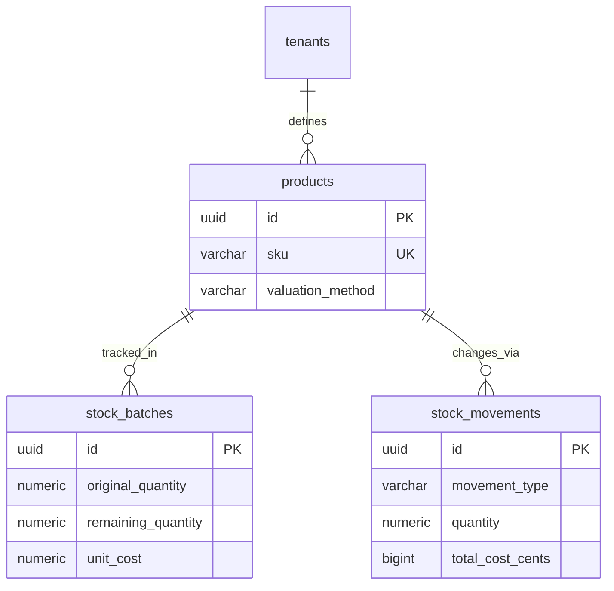

### 9.1 Table Specifications

#### `products`

- **Why it exists:** SKU catalog linked to general ledger asset, revenue, and COGS accounts.

```sql
CREATE TABLE products (
    id UUID PRIMARY KEY DEFAULT gen_random_uuid(),
    tenant_id UUID NOT NULL REFERENCES tenants(id) ON DELETE RESTRICT,
    sku VARCHAR(100) NOT NULL,
    name VARCHAR(200) NOT NULL,
    valuation_method VARCHAR(20) NOT NULL DEFAULT 'FIFO', -- FIFO, WAV
    inventory_account_id UUID NOT NULL REFERENCES chart_of_accounts(id) ON DELETE RESTRICT,
    cogs_account_id UUID NOT NULL REFERENCES chart_of_accounts(id) ON DELETE RESTRICT,
    sales_account_id UUID NOT NULL REFERENCES chart_of_accounts(id) ON DELETE RESTRICT,
    is_active BOOLEAN NOT NULL DEFAULT TRUE,
    created_at TIMESTAMPTZ NOT NULL DEFAULT clock_timestamp(),
    version INT NOT NULL DEFAULT 1,
    CONSTRAINT uq_products_tenant_sku UNIQUE (tenant_id, sku),
    CONSTRAINT chk_valuation_method CHECK (valuation_method IN ('FIFO', 'WAV'))
);
```

#### `stock_batches` & `stock_movements`

- **Why it exists:** Implements deterministic FIFO / WAV inventory depletion without negative quantities.

```sql
CREATE TABLE stock_batches (
    id UUID PRIMARY KEY DEFAULT gen_random_uuid(),
    tenant_id UUID NOT NULL REFERENCES tenants(id) ON DELETE RESTRICT,
    product_id UUID NOT NULL REFERENCES products(id) ON DELETE RESTRICT,
    source_invoice_line_id UUID REFERENCES invoice_lines(id) ON DELETE RESTRICT,
    received_date DATE NOT NULL,
    original_quantity NUMERIC(12, 4) NOT NULL,
    remaining_quantity NUMERIC(12, 4) NOT NULL,
    unit_cost_cents NUMERIC(18, 4) NOT NULL, -- Precise unit cost
    created_at TIMESTAMPTZ NOT NULL DEFAULT clock_timestamp(),
    CONSTRAINT chk_batch_non_negative CHECK (remaining_quantity >= 0 AND remaining_quantity <= original_quantity)
);
CREATE INDEX idx_stock_batches_fifo ON stock_batches (tenant_id, product_id, received_date ASC) WHERE remaining_quantity > 0;

CREATE TABLE stock_movements (
    id UUID PRIMARY KEY DEFAULT gen_random_uuid(),
    tenant_id UUID NOT NULL REFERENCES tenants(id) ON DELETE RESTRICT,
    product_id UUID NOT NULL REFERENCES products(id) ON DELETE RESTRICT,
    stock_batch_id UUID REFERENCES stock_batches(id) ON DELETE RESTRICT,
    journal_entry_id UUID REFERENCES journal_entries(id) ON DELETE RESTRICT,
    movement_type VARCHAR(20) NOT NULL, -- INFLOW_PURCHASE, OUTFLOW_SALE, ADJUSTMENT
    quantity NUMERIC(12, 4) NOT NULL,
    unit_cost_cents NUMERIC(18, 4) NOT NULL,
    total_cost_cents BIGINT NOT NULL,
    created_at TIMESTAMPTZ NOT NULL DEFAULT clock_timestamp()
);
CREATE INDEX idx_stock_movements_product ON stock_movements (tenant_id, product_id, created_at DESC);
```

---

## 10. Domain 10: AI Agents & Execution Traceability

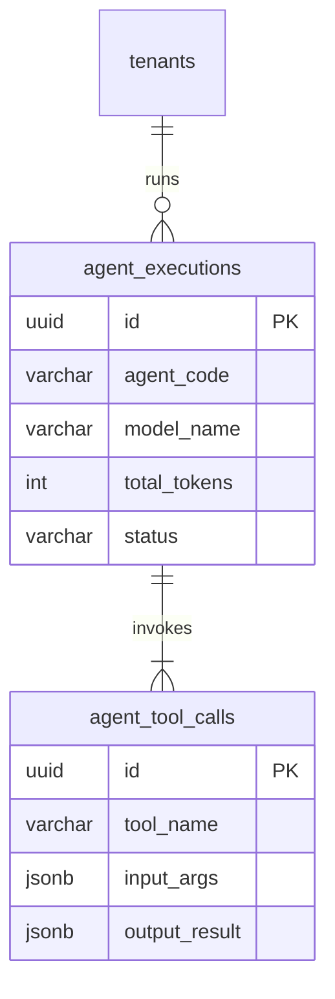

### 10.1 Table Specifications

#### `agent_executions`

- **Why it exists:** Audit trace of every autonomous AI agent invocation. Allows engineers to inspect prompts, token costs, and duration.

```sql
CREATE TABLE agent_executions (
    id UUID PRIMARY KEY DEFAULT gen_random_uuid(),
    tenant_id UUID NOT NULL REFERENCES tenants(id) ON DELETE RESTRICT,
    agent_code VARCHAR(50) NOT NULL, -- ACCOUNTANT, PAYROLL, INVENTORY
    model_name VARCHAR(100) NOT NULL, -- e.g. 'gemini-1.5-pro-002'
    trigger_event VARCHAR(100) NOT NULL, -- STATEMENT_PARSED, BILL_UPLOADED
    workflow_id VARCHAR(100),
    total_tokens_consumed INT NOT NULL DEFAULT 0,
    duration_ms INT NOT NULL,
    status VARCHAR(30) NOT NULL DEFAULT 'COMPLETED', -- COMPLETED, FAILED, TIMED_OUT
    error_message TEXT,
    created_at TIMESTAMPTZ NOT NULL DEFAULT clock_timestamp()
);
CREATE INDEX idx_agent_executions_tenant ON agent_executions (tenant_id, created_at DESC);
```

#### `agent_tool_calls`

- **Why it exists:** Detailed log of each discrete tool called by an agent during its reasoning loop.

```sql
CREATE TABLE agent_tool_calls (
    id UUID PRIMARY KEY DEFAULT gen_random_uuid(),
    agent_execution_id UUID NOT NULL REFERENCES agent_executions(id) ON DELETE CASCADE,
    tool_name VARCHAR(100) NOT NULL,
    input_arguments JSONB NOT NULL,
    output_result JSONB NOT NULL,
    execution_time_ms INT NOT NULL,
    is_error BOOLEAN NOT NULL DEFAULT FALSE,
    created_at TIMESTAMPTZ NOT NULL DEFAULT clock_timestamp()
);
CREATE INDEX idx_agent_tool_calls_exec ON agent_tool_calls (agent_execution_id);
```

---

## 11. Domain 11: Workflows & Outbox Engine

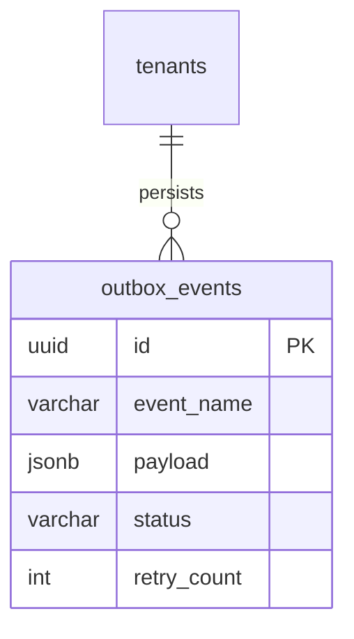

### 11.1 Table Specifications

#### `outbox_events`

- **Why it exists:** Implements the **Transactional Outbox Pattern** ([`ADR-0003`](file:///Users/mac/Desktop/projects/agentic_crm/docs/adr/ADR-0003-transactional-outbox-and-bullmq.md)). Prevents dual-write inconsistencies between PostgreSQL and Redis/BullMQ.

```sql
CREATE TABLE outbox_events (
    id UUID PRIMARY KEY DEFAULT gen_random_uuid(),
    tenant_id UUID NOT NULL REFERENCES tenants(id) ON DELETE RESTRICT,
    event_name VARCHAR(150) NOT NULL, -- e.g. 'StatementIngestionCompleted'
    aggregate_type VARCHAR(100) NOT NULL, -- 'BankStatement'
    aggregate_id UUID NOT NULL,
    payload JSONB NOT NULL,
    status VARCHAR(20) NOT NULL DEFAULT 'PENDING', -- PENDING, PUBLISHED, FAILED
    retry_count INT NOT NULL DEFAULT 0,
    created_at TIMESTAMPTZ NOT NULL DEFAULT clock_timestamp(),
    published_at TIMESTAMPTZ
);
CREATE INDEX idx_outbox_pending ON outbox_events (created_at ASC) WHERE status = 'PENDING';
```

---

## 12. Domain 12: Exception Center & Proposals

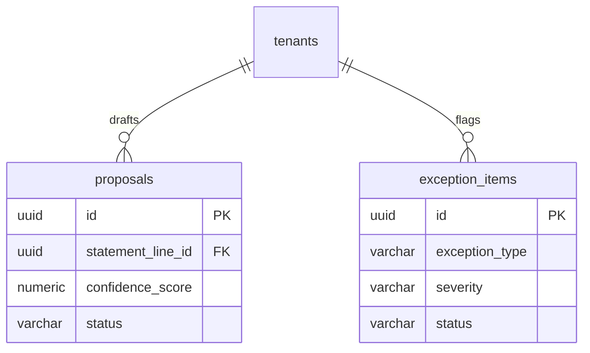

### 12.1 Table Specifications

#### `proposals`

- **Why it exists:** Staging table where AI agents draft candidate journal entries ([`ADR-0004`](file:///Users/mac/Desktop/projects/agentic_crm/docs/adr/ADR-0004-ai-agent-staging-and-zero-direct-ledger-mutation.md)). Never touches the General Ledger directly without passing the 6-stage deterministic gate or human sign-off.

```sql
CREATE TABLE proposals (
    id UUID PRIMARY KEY DEFAULT gen_random_uuid(),
    tenant_id UUID NOT NULL REFERENCES tenants(id) ON DELETE RESTRICT,
    statement_line_id UUID REFERENCES bank_transactions(id) ON DELETE CASCADE,
    invoice_id UUID REFERENCES invoices(id) ON DELETE CASCADE,
    debit_account_id UUID NOT NULL REFERENCES chart_of_accounts(id) ON DELETE RESTRICT,
    credit_account_id UUID NOT NULL REFERENCES chart_of_accounts(id) ON DELETE RESTRICT,
    amount_cents BIGINT NOT NULL,
    confidence_score NUMERIC(3, 2) NOT NULL,
    rationale TEXT NOT NULL,
    status VARCHAR(30) NOT NULL DEFAULT 'PROPOSED', -- PROPOSED, APPROVED, REJECTED, MODIFIED
    created_at TIMESTAMPTZ NOT NULL DEFAULT clock_timestamp(),
    resolved_at TIMESTAMPTZ,
    resolved_by_user_id UUID REFERENCES users(id),
    CONSTRAINT chk_proposal_amount CHECK (amount_cents > 0)
);
CREATE INDEX idx_proposals_tenant_status ON proposals (tenant_id, status) WHERE status = 'PROPOSED';
```

#### `exception_items`

- **Why it exists:** The single source of truth for items requiring human triage. Orders open items by priority and financial severity.

```sql
CREATE TABLE exception_items (
    id UUID PRIMARY KEY DEFAULT gen_random_uuid(),
    tenant_id UUID NOT NULL REFERENCES tenants(id) ON DELETE RESTRICT,
    entity_type VARCHAR(50) NOT NULL, -- BANK_TRANSACTION, STATEMENT, INVOICE
    entity_id UUID NOT NULL,
    exception_type VARCHAR(50) NOT NULL, -- UNRECOGNIZED_VENDOR, LOW_CONFIDENCE, UNBALANCED, SPIKE
    severity VARCHAR(20) NOT NULL DEFAULT 'MEDIUM', -- LOW, MEDIUM, HIGH, CRITICAL
    reason TEXT NOT NULL,
    proposed_resolution JSONB,
    status VARCHAR(20) NOT NULL DEFAULT 'OPEN', -- OPEN, RESOLVED, DISMISSED
    resolved_by_user_id UUID REFERENCES users(id),
    resolved_at TIMESTAMPTZ,
    created_at TIMESTAMPTZ NOT NULL DEFAULT clock_timestamp()
);
CREATE INDEX idx_exceptions_tenant_open ON exception_items (tenant_id, severity, created_at) WHERE status = 'OPEN';
```

---

## 13. Domain 13: Immutable Audit Trail

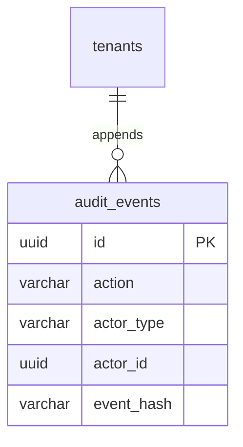

### 13.1 Table Specifications

#### `audit_events`

- **Why it exists:** Cryptographically chained, append-only log of every financial state change, user authorization, and AI recommendation.

```sql
CREATE TABLE audit_events (
    id UUID PRIMARY KEY DEFAULT gen_random_uuid(),
    tenant_id UUID NOT NULL REFERENCES tenants(id) ON DELETE RESTRICT,
    action VARCHAR(100) NOT NULL, -- e.g. 'JOURNAL_ENTRY_POSTED', 'PROPOSAL_APPROVED'
    entity_type VARCHAR(50) NOT NULL,
    entity_id UUID NOT NULL,
    actor_type VARCHAR(20) NOT NULL, -- USER, AI_AGENT, SYSTEM
    actor_id UUID NOT NULL,
    correlation_id VARCHAR(100),
    previous_state JSONB,
    new_state JSONB,
    diff JSONB,
    ip_address INET,
    previous_hash VARCHAR(64) NOT NULL,
    event_hash VARCHAR(64) NOT NULL, -- SHA-256(previous_hash + id + tenant_id + action + new_state)
    created_at TIMESTAMPTZ NOT NULL DEFAULT clock_timestamp()
);
CREATE INDEX idx_audit_events_tenant_timeline ON audit_events (tenant_id, created_at DESC);
CREATE INDEX idx_audit_events_entity ON audit_events (tenant_id, entity_type, entity_id);
```

### 13.2 Database Trigger for Invariant Immutability

```sql
CREATE OR REPLACE FUNCTION assert_audit_event_immutable()
RETURNS TRIGGER AS $$
BEGIN
    RAISE EXCEPTION 'audit_events is an append-only table. UPDATE and DELETE operations are forbidden.';
END;
$$ LANGUAGE plpgsql;

CREATE TRIGGER trg_audit_events_immutable
BEFORE UPDATE OR DELETE ON audit_events
FOR EACH ROW EXECUTE FUNCTION assert_audit_event_immutable();
```

---

## 14. Extensibility Mapping for Future Domains

The design intentionally avoids speculative tables for future domains while establishing clean, polymorphic foreign key anchors to support them seamlessly when phased in:

| Future Domain         | Primary Reusable Platform Anchor                     | How It Integrates Without Schema Rework                                                                          |
| :-------------------- | :--------------------------------------------------- | :--------------------------------------------------------------------------------------------------------------- |
| **HR Domain**         | `Identity: users`, `Payroll: employees`              | Employee lifecycle, leave tracking, and department org charts attach to `employees.id` and `users.id`.           |
| **CRM Domain**        | `Invoicing: counterparties`                          | Leads, pipelines, and customer communication logs attach directly to `counterparties.id` (type `CUSTOMER`).      |
| **Sales Domain**      | `Invoicing: invoices`, `Inventory: products`         | Sales quotes and pipeline orders convert directly to `invoices` with line items referencing `products.id`.       |
| **Support Domain**    | `Exceptions: exception_items`, `AR/AP: payments`     | Billing disputes and customer tickets map to `counterparties.id` and generate triage items in `exception_items`. |
| **Operations Domain** | `Inventory: stock_movements`, `Documents: documents` | Warehouse transfers and supplier shipping receipts map to `stock_movements` and `documents`.                     |
